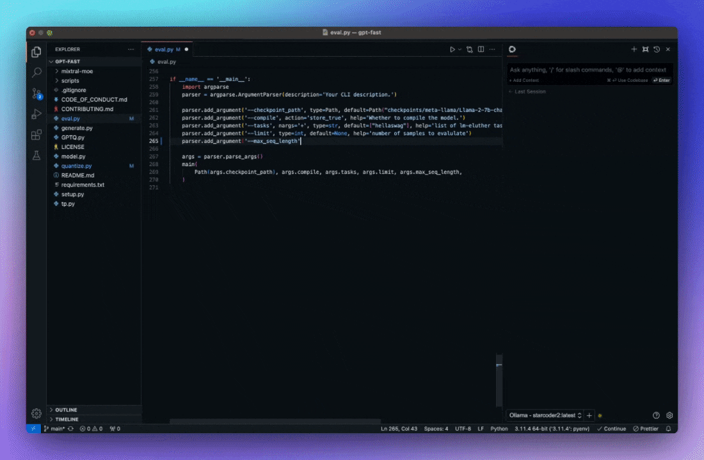
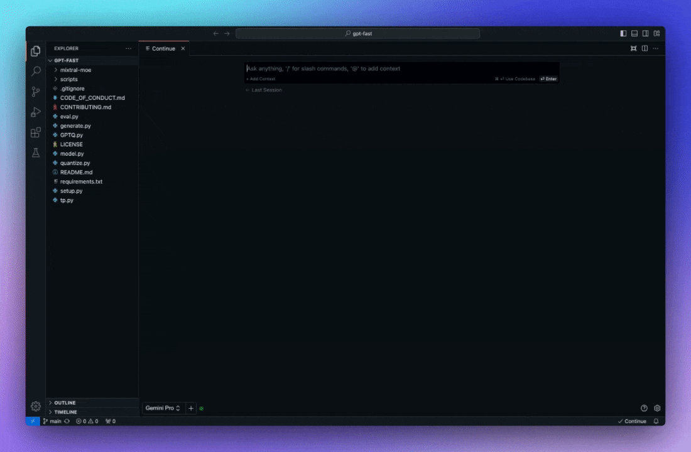
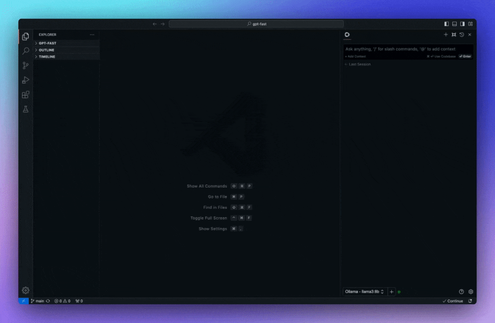

<h1 align="center">Continue</h1>

**[Continue](https://docs.continue.dev) enables you to create your own AI code assistant inside your IDE. Keep your developers in flow with open-source [VS Code](https://marketplace.visualstudio.com/items?itemName=Continue.continue) and [JetBrains](https://plugins.jetbrains.com/plugin/22707-continue-extension) extensions that can be connected to any model, any context, and anything else you need**

## Easily understand code sections

VS Code: `cmd+L` (MacOS) / `ctrl+L` (Windows)

JetBrains: `cmd+J` (MacOS) / `ctrl+J` (Windows)

## Tab to autocomplete code suggestions

VS Code: `tab` (MacOS) / `tab` (Windows)

JetBrains: `tab` (MacOS) / `tab` (Windows)

## Refactor functions where you are coding

VS Code: `cmd+I` (MacOS) / `ctrl+I` (Windows)

JetBrains: `cmd+I` (MacOS) / `ctrl+I` (Windows)

## Ask questions about your codebase

VS Code: `cmd+enter` (MacOS) / `ctrl+enter` (Windows)

JetBrains: `cmd+enter` (MacOS) / `ctrl+enter` (Windows)

## Quickly use documentation as context

VS Code: `@docs` (MacOS) / `@docs` (Windows)

JetBrains: `@docs` (MacOS) / `@docs` (Windows)

## Getting Started

### Download for [VS Code](https://marketplace.visualstudio.com/items?itemName=Continue.continue) and [JetBrains](https://plugins.jetbrains.com/plugin/22707-continue-extension)

You can try out Continue with our free trial models before configuring your setup.

Learn more about the models and providers [here](https://continue.dev/docs/setup/overview).

## Contributing

Check out the [contribution ideas board](https://github.com/orgs/continuedev/projects/2), read the [contributing guide](https://github.com/continuedev/continue/blob/main/CONTRIBUTING.md), and join [#contribute on Discord](https://discord.gg/vapESyrFmJ)

## License

[Apache 2.0 © 2023 Continue Dev, Inc.](./LICENSE)
