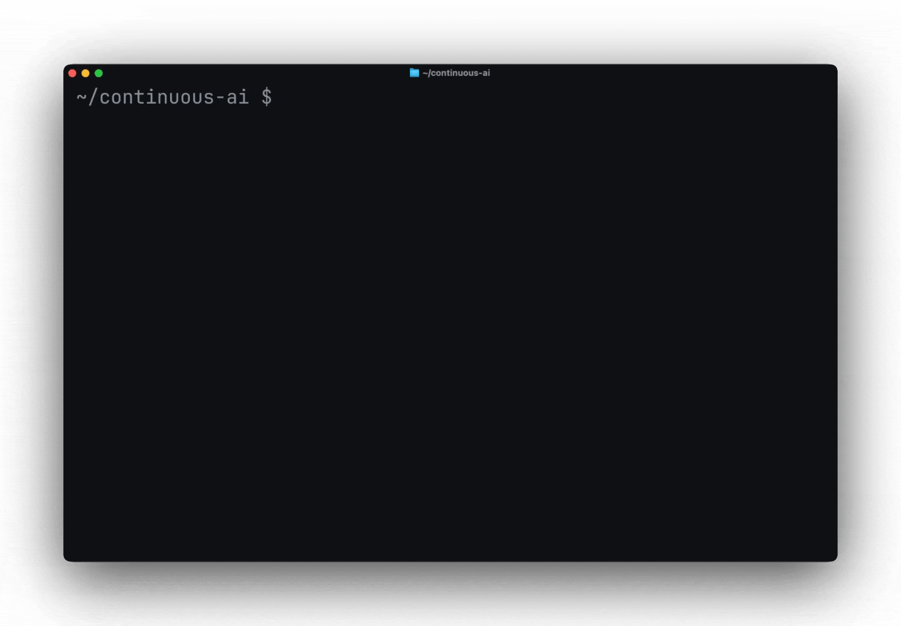
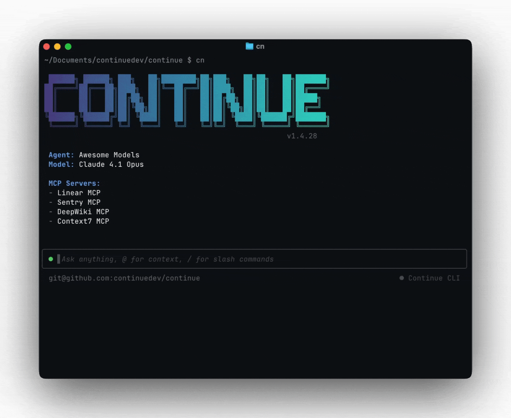
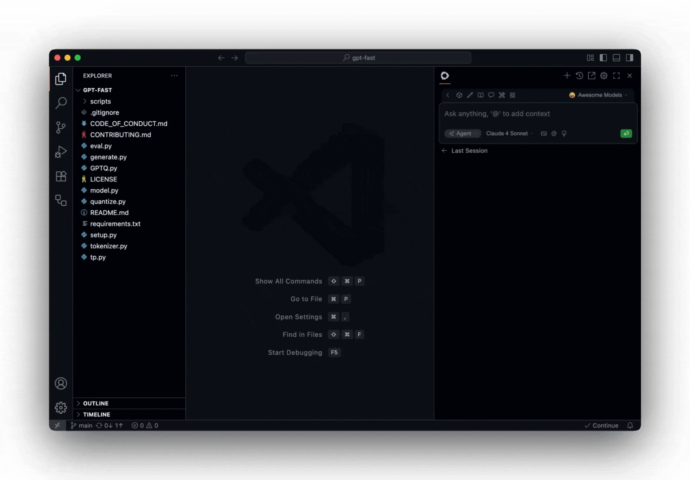

<h1 align="center">Continue - Code Mode</h1>

<div align="center">

<p></p>

<div align="center">

**Ship faster with Continuous AI**

**The future of coding isn't writing more code. It's delegating the boring parts, so you can build the interesting stuff**

</div>

---

## Code Mode: Execute TypeScript to Call MCP Tools

Continue introduces **Code Mode**—a revolutionary approach to AI tool calling that replaces verbose JSON schemas with **actual TypeScript code execution** as per Anthropic's and Cloud Flair's research.

### Why This Matters

**Traditional JSON Tool Calling:**
- Tool schemas consume 2,000-4,000 tokens per request
- Each tool call requires a separate round-trip to the LLM
- No composition (can't loop, use conditionals, or maintain state)
- Hard to debug (no stack traces, no type checking)

**Code Mode:**
- **75-85% fewer tokens** (schemas loaded on-demand, not in every request)
- **Single execution** for multi-step workflows (no round-trips)
- **Real composition** (loops, async/await, error handling, variables)
- **Superior DX** (autocomplete, type checking, debugging tools)

### How It Works

Instead of generating JSON like this:

```json
{
  "toolCalls": [
    {
      "type": "function",
      "function": {
        "name": "github_create_issue",
        "arguments": "{\"owner\": \"myorg\", \"repo\": \"myrepo\", \"title\": \"Bug\"}"
      }
    }
  ]
}
```

Your agent writes and executes real TypeScript:

```typescript
import { github } from '/mcp';

await github.createIssue({
  owner: "myorg",
  repo: "myrepo",
  title: "Bug",
  body: "...",
});
```

### Quick Start

1. **Get an E2B API key** (free tier available): [e2b.dev](https://e2b.dev)

2. **Enable Code Mode** in your `.continue/config.yaml`:

```yaml
experimental:
  codeExecution:
    enabled: true
    e2bApiKey: "your-e2b-api-key"

# Configure MCP servers (plug-and-play!)
mcpServers:
  github:
    command: npx
    args: ["-y", "@modelcontextprotocol/server-github"]
    env:
      GITHUB_TOKEN: "${GITHUB_TOKEN}"
```

3. **Use it!** Ask your agent to perform multi-step tasks:

> "Find all open bugs labeled 'priority:high' and create a summary report"

The agent will write:

```typescript
import { github } from '/mcp';

const issues = await github.listIssues({ state: 'open' });
const bugs = issues.filter(i => i.labels.some(l => l.name === 'bug'));
const highPriority = bugs.filter(i =>
  i.labels.some(l => l.name === 'priority:high')
);

console.log(`Found ${highPriority.length} high-priority bugs`);
return { bugs: highPriority };
```

**Plug-and-play with any MCP server** — no code changes needed. Popular servers:
- [`@modelcontextprotocol/server-github`](https://github.com/modelcontextprotocol/servers/tree/main/src/github) - GitHub API
- [`@modelcontextprotocol/server-filesystem`](https://github.com/modelcontextprotocol/servers/tree/main/src/filesystem) - File operations
- [`@modelcontextprotocol/server-google-drive`](https://github.com/modelcontextprotocol/servers/tree/main/src/gdrive) - Google Drive
- [And many more...](https://github.com/modelcontextprotocol/servers)

**[Read the full Code Mode documentation →](docs/features/code-mode-readme.md)**

---

## Cloud Agents

Set workflows to run automatically on [PR opens](https://docs.continue.dev/guides/continuous-ai#pattern-2-the-pr-review-agent), [schedules](https://docs.continue.dev/guides/continuous-ai#pattern-1-the-async-triage-bot), or [any event trigger](https://docs.continue.dev/cli/quick-start#headless-mode)



## CLI Agents

Watch workflows execute in real-time and approve decisions step-by-step from your [terminal](https://docs.continue.dev/cli/quick-start#tui-mode)



## IDE Agents

Trigger workflows from [VS Code](https://marketplace.visualstudio.com/items?itemName=Continue.continue) or [JetBrains](https://plugins.jetbrains.com/plugin/22707-continue-extension)—let agents handle the refactoring while you keep coding



</div>

## Contributing

Read the [contributing guide](https://github.com/continuedev/continue/blob/main/CONTRIBUTING.md), and
join [#contribute on Discord](https://discord.gg/vapESyrFmJ).

## License

[Apache 2.0 © 2023-2024 Continue Dev, Inc.](./LICENSE)
