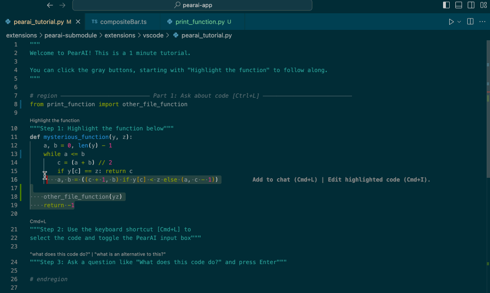
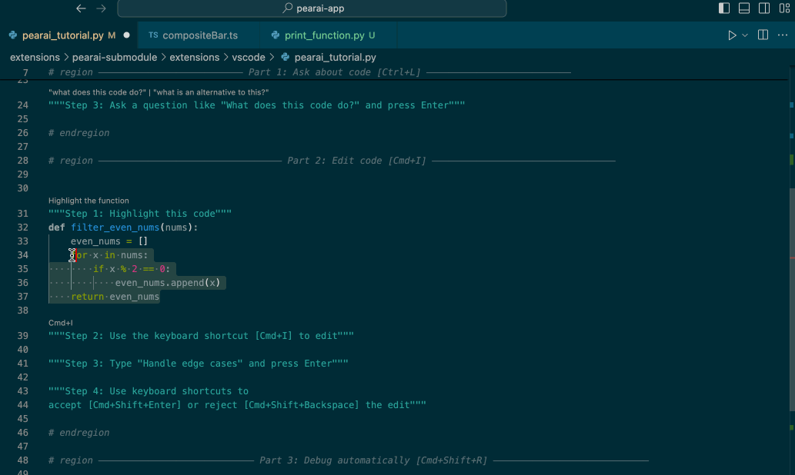
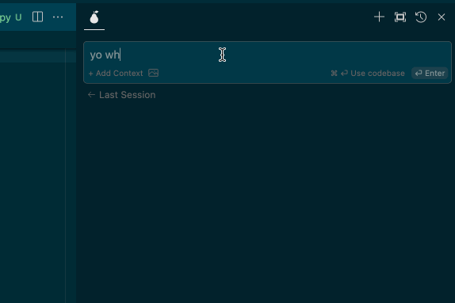

# PearAI Submodule / Extension (Fork of [Continue](https://github.com/continuedev/continue))

This is the source code for the bulk of PearAI's functionality, which is bundled as a VSCode / PearAI extension. It is a fork of [Continue](https://github.com/continuedev/continue).

## 🌐 **For how to setup, build, and run PearAI, please visit [PearAI Contributing](https://github.com/trypear/pearai-app/blob/main/CONTRIBUTING.md)!**

## Features 🚀

### Easily understand code sections 🤔

VS Code: `cmd+L` (MacOS) / `ctrl+L` (Windows)

### Refactor functions where you are coding 🛠️

VS Code: `cmd+I` (MacOS) / `ctrl+I` (Windows)

### Ask questions by mentioning a file 📚

<!-- Specific width to match other gifs -->

## License

[Apache 2.0 © 2023 Continue](./LICENSE)