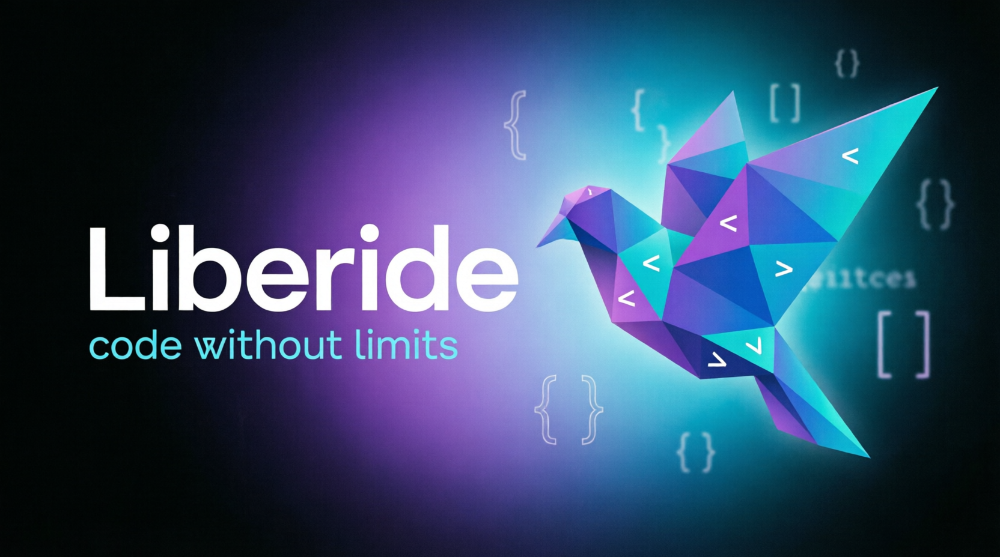

<p align="center">
  
</p>
<h1 align="center">Liberide</h1>

<p align="center">
  <b>Open-source coding agent</b><br />
  <i>Forked from Continue. Relicensed under GPL v3.</i>
</p>

<p align="center">
  <a href="https://github.com/liberide/liberide/blob/main/LICENSE">
    
  </a>
  <a href="https://liberide.dev">
    
  </a>
  <a href="https://github.com/liberide/liberide/releases">
    
  </a>
</p>


<p align="center">
  
</p>

---

## What is Liberide?

Liberide is a fully open-source coding agent that brings AI assistance directly into your development workflow.

> **Note:** This project is an independent fork of [Continue](https://github.com/continuedev/continue), which is no longer actively maintained. Liberide continues the mission under the **GNU General Public License v3**, ensuring the codebase remains completely free and open for the community.

---

## Project Status

Liberide is currently in a **refactoring and rebranding stage**.

We are actively working on:
- Rebranding the codebase from Continue to Liberide
- Updating documentation and build pipelines
- Cleaning up dependencies and legacy code
- Preparing the project for public contributions

> **The project is not yet ready for end users.** Significant work is required before extensions and plugins can be built and distributed. We appreciate your patience and will announce updates as milestones are reached.

---

## Roadmap

- [ ] Complete rebranding and code cleanup
- [ ] Refactor build system and CI/CD pipelines
- [ ] VS Code Extension (planned)
- [ ] JetBrains Plugin (planned)
- [ ] CLI Tool (planned)
- [ ] Extended model support
- [ ] Enhanced privacy features
- [ ] Community plugins API

<!--
## Installation

### VS Code

Coming soon to the VS Code Marketplace.

### JetBrains

Coming soon to the JetBrains Marketplace.

### CLI

```bash
npm install -g @liberide/cli
```
-->

---

## Philosophy

Liberide is and always will be **fully open source**.

- No telemetry
- No authentication gates
- No proprietary lock-in
- Community-driven development

---

## Contributing

We welcome contributions! Please read our [Contributing Guide](CONTRIBUTING.md) and note that all contributions are licensed under **GPL v3**.

---

## Acknowledgments

Liberide is built on the foundation of **[Continue](https://github.com/continuedev/continue)** by Continue Dev, Inc.  
We are grateful to the original authors and the Continue community for their pioneering work in open-source AI developer tooling.

---

## License

This project is licensed under the **GNU General Public License v3.0 or later**.  
The original Continue codebase is licensed under the [Apache License 2.0](LICENSE-APACHE).

See [LICENSE](LICENSE) and [NOTICE](NOTICE) for full details.
