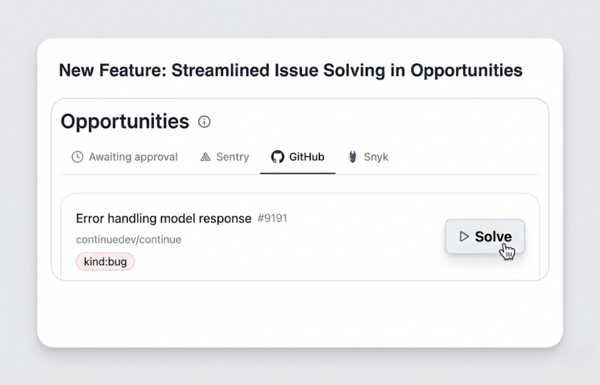

<Update label="December 2025">
## **Discover Opportunities You Can Hand Off**

 Over the past month, we’ve been laying the groundwork to make cloud agents reliable, discoverable, and easy to trigger from the tools you already use. The result is a shift in how you interact with Continue: less setup, less context switching, and more automation driven directly from your workflow.

Continue Integrations can now surface actionable work from tools you already rely on, including:

- Sentry alerts
- Snyk vulnerabilities
- GitHub Issues
- and more

Theese Opportunities are suggested pieces of work (issues, improvements, or follow-ups) that are worth doing that can be delegated to an agent.  When an opportunity looks useful, you can turn it into a task and let an agent take the first pass—then review or approve the results.

<iframe
  className="w-full aspect-video rounded-xl"
  src="https://www.youtube.com/watch?v=WR76-SMaaxc"
  title="YouTube video player"
  allow="accelerometer; autoplay; clipboard-write; encrypted-media; gyroscope; picture-in-picture"
  allowFullScreen
></iframe>

### **Automate Your Workflows with Cloud Agents**

You can now automate workflows across tools like PostHog, Supabase, Netlify, Atlassian, and Sanity using cloud agents.

Instead of manually stitching together dashboards, alerts, and follow-up tasks, Continue cloud agents can monitor signals, take action, and push work forward automatically. This makes Continue useful not just for coding tasks, but for the operational work that surrounds shipping software.

Cloud agents are designed to run continuously and reliably, which is why much of the recent work focused on session stability, execution reliability, and onboarding improvements.

### **Trigger Agents from Slack and GitHub**

You can now kick off cloud agents directly from Slack and GitHub using @Continue.

Mention Continue where the conversation is already happening—whether it’s a Slack thread or a GitHub comment—and the agent will pick up the context and start running. This keeps you in flow and avoids the overhead of switching tools just to start automation.

</Update>