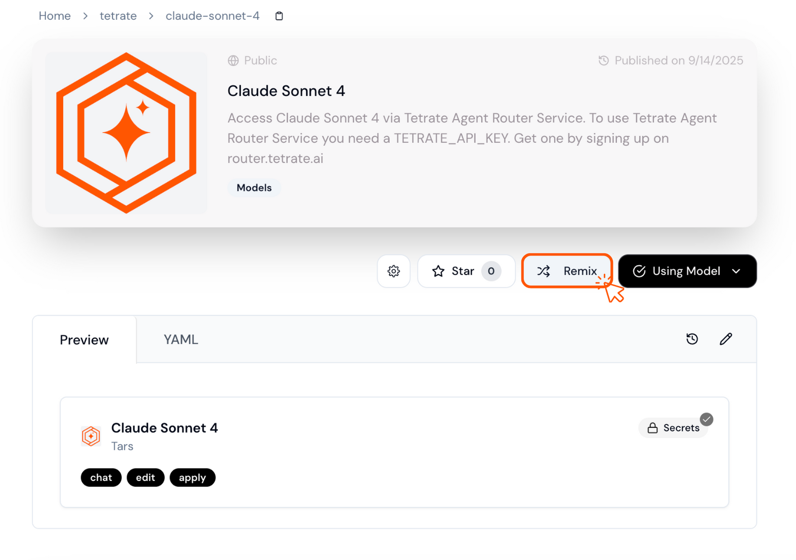

The **Tetrate Agent Router Service** provides a unified Gateway for accessing various AI models with fast inference capabilities.

This gateway acts as an intelligent router that can distribute requests across multiple model providers, offering enterprise-grade reliability and performance optimization.

<Tip>
Want to get started quickly? Sign up for the [Tetrate Agent Router Service](https://router.tetrate.ai/) to get an API key, then use [Tetrate on Continue Mission Control](https://hub.continue.dev/tetrate) to get started fast.
</Tip>

## Setup

<Steps>
<Step title="Sign in or sign up">
Visit the [Agent Router Service portal](https://router.tetrate.ai/) and create an account to get your API key

</Step>

<Step title="Get your API key">
Go to the [API keys page](https://router.tetrate.ai/api-keys) to get your key

</Step>

<Step title="Configure Continue">
- Choose a configuration method below.
- If you use the Continue VS Code extension, install version `>=1.2.3`.
</Step>

</Steps>


### Quickstart with Continue Mission Control

Fastest way: use preconfigured models from Tetrate on Continue Mission Control

<Steps>
<Step title="Browse models">
Open [Tetrate on Continue Mission Control](https://hub.continue.dev/tetrate) and pick a model (e.g., [Claude Sonnet 4](https://hub.continue.dev/tetrate/claude-sonnet-4))
</Step>

<Step title="Use or remix">
Click "Use Model", or "Remix" to change the model ID if needed
</Step>

<Step title="Add your API key">
Add your API key to Continue. See [adding secrets in Continue Mission Control](/mission-control/secrets/secret-types) and [managing local secrets in the FAQ](/faqs#managing-local-secrets-and-environment-variables)
<Tip>
Add it as a Continue Mission Control secret named `TETRATE_API_KEY` to reuse across projects.
</Tip>
</Step>
</Steps>



<Info>
If a model is missing, remix a similar one and set the `model` field to the target ID.
</Info>

### Configuration Methods

<CardGroup cols={1}>
  <Card title="In Local Agent Configuration" icon="folder" vertical>
    Use a Tetrate model block from the Hub or define it directly in your local agent configuration.
  </Card>
  <Card title="Continue Mission Control" icon="cloud" vertical>
    Use a Tetrate model block from the Hub or define your own on the Hub.
  </Card>
  <Card title="Using Local Model Blocks" icon="file-lines" vertical>
    Create a local model block for reuse across agents without publishing it to the Hub.
  </Card>
</CardGroup>


### Configuration Examples
<Info>
**Click a tab** to see an example.
</Info>
<Tabs>
<Tab title="In Local Agent Configuration">

**When to use**: Simple local setups (like using the VS Code extension) when you don't need shared or published blocks.

Use a Tetrate model block from the Hub in your local agent configuration:

```yaml title="~/.continue/config.yaml"
name: Local Agent
version: 1.0.0
schema: v1
models:
  - uses: tetrate/claude-sonnet-4
    with:
      TETRATE_API_KEY: ${{ secrets.TETRATE_API_KEY }}
context:
  - provider: code
  - provider: docs
  - provider: diff
  - provider: terminal
  - provider: problems
  - provider: folder
  - provider: codebase
```

Or define the model directly:

```yaml title="~/.continue/config.yaml"
name: Local Agent
version: 1.0.0
schema: v1
models:
  - name: Claude Sonnet 4
    provider: tars
    model: claude-4-sonnet-20250514
    apiKey: ${{ secrets.TETRATE_API_KEY }}
    roles:
      - chat
      - edit
      - apply
    capabilities:
      - tool_use
context:
  - provider: code
  - provider: docs
  - provider: diff
  - provider: terminal
  - provider: problems
  - provider: folder
  - provider: codebase
```
</Tab>
<Tab title="Continue Mission Control">
**When to use**: Share configurations across teams or contribute to the community.

**The Model Block:**

```yaml title="tetrate/claude-sonnet-4"
name: Claude Sonnet 4
version: 1.0.14
schema: v1
models:
  - name: Claude Sonnet 4 - Tetrate
    provider: tars
    model: claude-4-sonnet-20250514
    apiKey: ${{ inputs.TETRATE_API_KEY }}
    roles:
      - chat
      - edit
      - apply
    capabilities:
      - tool_use
```
View the model block `tetrate/claude-sonnet-4` on the [Continue Mission Control](https://hub.continue.dev/tetrate/claude-sonnet-4).

**Reference it in your Agent configuration:**

```yaml title="my-agent"
name: My Agent
version: 1.0.0
schema: v1
models:
  - uses: tetrate/claude-sonnet-4
    with:
      TETRATE_API_KEY: ${{ secrets.TETRATE_API_KEY }}
context:
  - uses: continuedev/diff-context
  - uses: continuedev/terminal-context
  - uses: continuedev/file-context
```

</Tab>

<Tab title="Using Local Model Blocks">
**When to use**: Reuse configurations across agents and keep them local or in GitHub (not on Continue Mission Control).

**The Local Model Block:**
<Info>
Name the file `my-claude-4-model.yaml` so you can reference it in the Agent.
</Info>

```yaml title="~/.continue/models/my-claude-4-model.yaml"
name: Claude Sonnet 4
version: 1.0.1
schema: v1
models:
  - name: Claude Sonnet 4
    provider: tars
    model: claude-4-sonnet-20250514
    apiKey: ${{ inputs.TETRATE_API_KEY }}
    roles:
      - chat
      - edit
      - apply
    capabilities:
      - tool_use
```
Reference it as `my-claude-4-model` in your Agent configuration:

```yaml title="~/.continue/agents/simple-agent.yaml"
name: Simple Agent
version: 1.0.0
schema: v1
models:
  - uses: my-claude-4-model
    with:
      TETRATE_API_KEY: ${{ secrets.TETRATE_API_KEY }}
context:
  - uses: continuedev/diff-context
  - uses: continuedev/terminal-context
  - uses: continuedev/file-context
```

<Tip>
Learn more about [model blocks](/reference#models) and [local blocks](/reference#local-blocks).
</Tip>

</Tab>
</Tabs>

---

## Troubleshooting Common Issues

<CardGroup cols={2}>
  <Card title="Invalid API key" icon="key" vertical>
    Verify your API key is active and has no extra spaces.
  </Card>
  <Card title="Model not found" icon="ban" href="https://router.tetrate.ai/models" vertical>
    Confirm the model ID matches the Tetrate catalog.
  </Card>
  <Card title="Slow responses" icon="code" vertical>
    Check your network or try a less-loaded model. Contact Tetrate support if issues persist.
  </Card>
  <Card title="Configuration not loading" icon="file-lines" vertical>
    Validate YAML syntax and review error messages in Continue. If using Hub, ensure the block is published.
  </Card>
</CardGroup>

---

## Join the Community
Connect with Tetrate and other builders for help and discussion.

<CardGroup cols={1}>
  <Card title="Join the Tetrate Community" icon="slack" href="https://join.slack.com/t/tetrate-agent-router/shared_invite/zt-399tv7hjm-6YMXztGywTOQrMIolvEBNg">
Get answers, insights, and best practices for secure, scalable infrastructure
  </Card>
</CardGroup>
