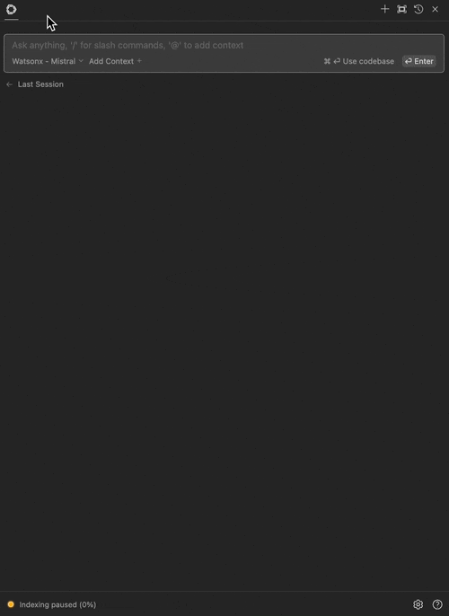

# IBM watsonx

watsonx, developed by IBM, offers a variety of pre-trained AI foundation models that can be used for natural language processing (NLP), computer vision, and speech recognition tasks.

## Setup

Accessing watsonx models can be done either through watsonx SaaS on IBM Cloud or using a dedicated watsonx.ai Software instance.

### watsonx.ai SaaS - IBM Cloud

To get started with watsonx SaaS, visit the [registration page](https://dataplatform.cloud.ibm.com/registration/stepone?context=wx). If you do not have an existing IBM Cloud account, you can sign up for a free trial.

To authenticate to watsonx.ai SaaS with Continue, you will need to create a project and [setup an API key](https://www.ibm.com/docs/en/mas-cd/continuous-delivery?topic=cli-creating-your-cloud-api-key). Then, in continue:

- Set **watsonx URL** to your watsonx SaaS endpoint, e.g. `https://us-south.ml.cloud.ibm.com` for US South region.
- Set **watsonx Project ID** to your watsonx project ID.
- Set **watsonx API Key** to your watsonx API Key.

### watsonx.ai Software

To authenticate to your watsonx.ai Software instance with Continue, you can use either `username/password` or `ZenApiKey` method:

1. _Option 1_ (Recommended): using `ZenApiKey` authentication:
   - Set **watsonx URL** to your watsonx software endpoint, e.g. `https://cpd-watsonx.apps.example.com`.
   - Set **watsonx Project ID** to your watsonx project ID.
   - Set **watsonx API Key** to your watsonx Zen API Key. To generate it:
     1. Log in to the CPD web client.
     2. From the toolbar, click your avatar.
     3. Click **Profile and settings**.
     4. Click **API key** > **Generate new key**.
     5. Click **Generate**.
     6. Click **Copy** and save your key somewhere safe. You cannot recover this key if you lose it.
     7. Generate your ZenApiKey by running the following command in your preferred terminal: `echo "<username>:<apikey>" | base64`, replacing `<username>` with your CPD username and `<apikey>` with the API Key you just created.
2. _Option 2_: using `username/password` authentication:
   - Set **watsonx URL** to your watsonx software endpoint, e.g. `https://cpd-watsonx.apps.example.com`.
   - Set **watsonx Project ID** to your watsonx project ID.
   - Set **watsonx API Key** to your watsonx Username and Password using `username:password` as format.

## Configuration

Add the following configuration to your `config.json` file to use the watsonx provider. Fill in the `watsonxCreds` with the authentication details you obtained in the setup step.

```json title="~/.continue/config.json"
{
  "models": [
    {
      "model": "model ID",
      "title": "watsonx - Model Name",
      "watsonxUrl": "watsonx endpoint e.g. https://us-south.ml.cloud.ibm.com",
      "watsonxProjectId": "PROJECT_ID",
      "watsonxCreds": "API_KEY/ZENAPI_KEY/USERNAME:PASSWORD",
      "watsonxApiVersion": "2023-05-29",
      "provider": "watsonx"
    }
  ]
}
```

`watsonxAPIVersion` is optional and defaults to the latest version.

### Configuration Options

Add the full watsonx URL to `watsonxFullUrl` if you are using a custom endpoint. When `watsonxFullUrl` is set, `watsonxUrl` and `watsonxApiVersion` are ignored.

```json title="~/.continue/config.json"
{
  "models": [
    {
      "model": "model ID",
      "title": "watsonx - Model Name",
      "watsonxUrl": "watsonx endpoint e.g. https://us-south.ml.cloud.ibm.com",
      "watsonxProjectId": "PROJECT_ID",
      "watsonxCreds": "API_KEY",
      "watsonxApiVersion": "2023-05-29",
      "provider": "watsonx",
      "watsonxFullUrl": "https://us-south.ml.cloud.ibm.com/m1/v1/text/generation"
    }
  ]
}
```

## Usage


