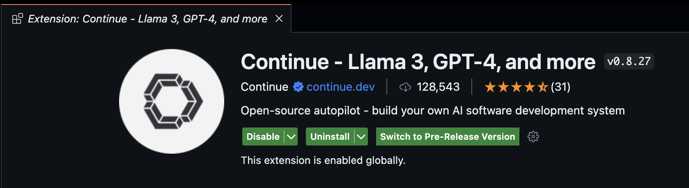

## Prerequisites

Ensure you have Visual Studio Code installed. If not, download and install it from the [Visual Studio Code download page](https://code.visualstudio.com/download).

## Installation Options

There are three ways to install the Continue extension in Visual Studio Code:

1. Install from VS Code Marketplace (Web)
2. Install from VS Code Extensions Marketplace
3. Manual Installation using VSIX

Choose the method that best suits your preference and setup. Each option is detailed below.

### Option 1: Install from VS Code Marketplace (Web)

1. Visit the [Continue extension page on the Visual Studio Marketplace](https://marketplace.visualstudio.com/items?itemName=Continue.continue).
2. Click the `Install` button on the page.
3. This will open VS Code (if it's not already open) and take you to the extension page within VS Code.
4. Click `Install` in VS Code to complete the installation.

### Option 2: Install from VS Code Extensions Marketplace

1. Open Visual Studio Code.
2. Navigate to the Extensions view (Ctrl+Shift+X or Cmd+Shift+X).
3. Search for "Continue" in the marketplace.
4. Click `Install` next to the Continue extension.

### Option 3: Manual Installation using VSIX

1. Download the latest VSIX package from the [Continue GitHub repository](https://github.com/continuedev/continue/releases).
2. In VS Code, go to Extensions view.
3. Click on the "..." menu at the top of the Extensions sidebar.
4. Select `Install from VSIX...`.
5. Navigate to the downloaded VSIX file and select it.

## Post-Installation Setup

1. After installation, you'll see the Continue logo in the left sidebar.
2. Click it to open the Continue extension.
3. We recommend moving Continue to VS Code's right sidebar:

This keeps the file explorer accessible while using Continue.

## Getting Started with Continue

Now that you've successfully installed Continue, you're ready to enhance your coding experience. Here's a quick summary of what you can do:

1. **Open the Continue sidebar**: Click the Continue logo in the sidebar to access the extension's features.
2. **Start a conversation**: Use the chat interface to ask questions, get code suggestions, or request explanations.
3. **Explore commands**: Familiarize yourself with Continue's commands to streamline your workflow.
4. **Customize settings**: Adjust the extension's settings to suit your preferences and coding style.

For more detailed information on using Continue, check out our [user guide](../how-to-use-continue.md).

## Pre-release Version (Optional)

The VS Code Continue extension is currently in beta. A pre-release version is available with the latest fixes and features. To install the pre-release version:

1. Open Visual Studio Code.
2. Navigate to the Extensions view (Ctrl+Shift+X or Cmd+Shift+X).
3. Search for "Continue" in the installed extensions.
4. Select `Switch to Pre-release Version` from the menu.

## Troubleshooting

If you encounter any issues, please refer to our [troubleshooting guide](.././troubleshooting.md) or ask for help in [our Discord community](https://discord.gg/NWtdYexhMs).
