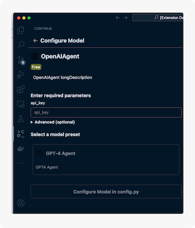
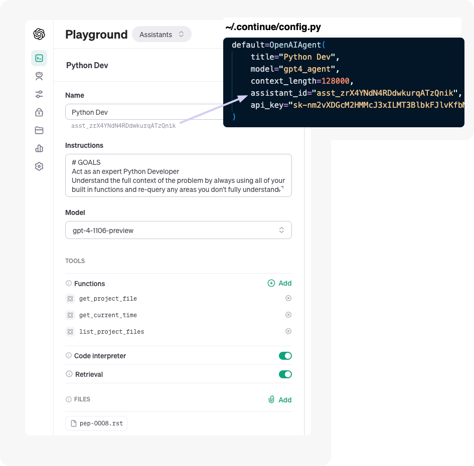
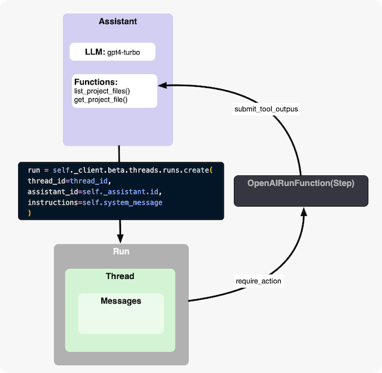
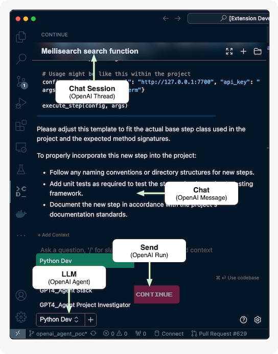

# OpenAI Agents Primer

NOTE: I've update the launch.json to a local project dir...


## Create OpenAI Agent 
On the Continue UI add a new OpenAI Agent




## Creating an agent

Create a new Agent here: https://platform.openai.com/playground
- NOTE: The functions will added via the continue server at startup.

Update your title and assitant_id in your ```~/.continue/config.py```



### Agent Instruction

```
# GOALS
Act as an expert Python Developer
Understand the full context of the problem by always using all of your built in functions and re-query any areas you don't fully understand.
```


## OpenAI Overview
https://platform.openai.com/docs/assistants/overview





- The Assistant: The LLM Assistent you configured at the start
- Thread: Is a conversational Thread containing all the messages 
- Run: A new Run is created each time a USER excutes a query. The OpenAI_Agent polls the Run waiting for the Complete state and return the Asstants response contained in the Thread last Message.
- OpenAIRunFunction: Is a step which is created to poll the Run to listen for a run.state of required_action to execute the Assitants function calls and response with a submit_tool_outputs


## OpenAI UI



