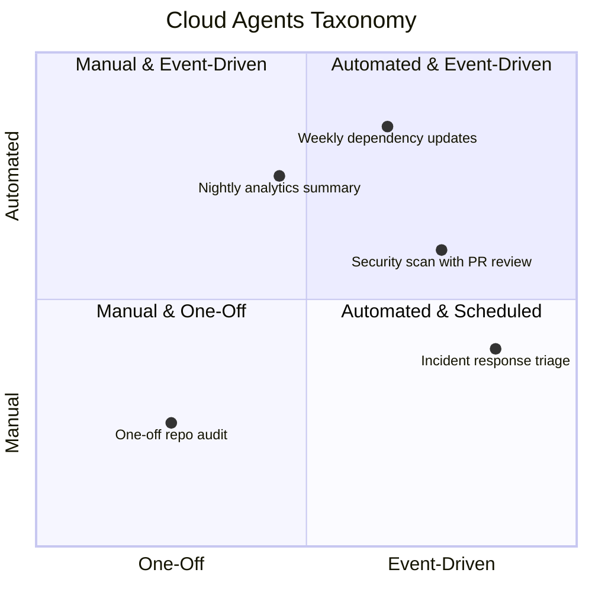

## Why This Taxonomy Exists

“Cloud agents” is a term that gets used to describe everything from cron jobs to IDE copilots.

That ambiguity causes teams to:
- choose the wrong abstraction
- automate too early
- or avoid cloud agents entirely because they feel risky

This guide exists to:

> **Define what cloud agents actually are, how they differ from other agents, and when they make sense for software teams.**

## A Clear Definition of Cloud Agents

<Info>
A **cloud agent** is an AI-driven process that runs on remote infrastructure, is triggered by tasks, schedules, or external events, and uses reasoning over changing inputs to produce reviewable outcomes across shared engineering systems.
</Info>

Key characteristics:
- runs outside a developer’s local environment
- operates on shared team context (repos, alerts, analytics, infra)
- produces reviewable outcomes (PRs, reports, actions)
- can run asynchronously and repeatedly

Cloud agents exist to **handle work that benefits from reasoning, shared context, and reviewability.** 

## What Cloud Agents Are Often Confused With

Cloud agents are often confused with other tools.

<CardGroup cols={2}>
  <Card title="Not IDE Agents">
    IDE agents focus on individual productivity and local context. Cloud agents operate on shared systems and team-owned work.
  </Card>

  <Card title="Not Just Cron Jobs">
    Cron is a trigger. Cloud agents reason over changing inputs and produce reviewable outcomes.
  </Card>

  <Card title="Not One-Off Scripts">
    Scripts execute fixed logic. Cloud agents apply reasoning and shared context even for a single run.
  </Card>

  <Card title="Not Magic Automation">
    Cloud agents still require review, ownership, and guardrails.
  </Card>
</CardGroup>

## The Two Axes That Matter

Cloud agents are best understood along **two dimensions**:
1. **What triggers them**
2. **How they’re governed**

Everything else is implementation detail.

*Most teams start bottom-left and move diagonally as trust increases to create their [Continuous AI Workflow](../continuous-ai).*

## Axis 1: Cloud Agent Trigger Type

### 1. One-Off Cloud Agents  
*Manually triggered when a human explicitly dispatches work to an agent. One-off cloud agents are first-class agents that differ by trigger, not by capability.*

<Columns cols={2}>
  <Card title="Examples">
  - Analyze the top recurring Sentry errors
  - Audit a repo for security issues
  - Summarize system behavior
  </Card>
  <Card title="Best for">
  - Unknown scope
  - Exploratory work
  - Building confidence before automation
  </Card>
</Columns>

### 2. Scheduled Cloud Agents  
*Time-based triggers that run on a fixed cadence (daily, weekly, hourly).*

<Columns cols={2}>
  <Card title="Examples">
  - Weekly vulnerability scans
  - Nightly analytics summaries
  - Regular dependency updates
  </Card>
  <Card title="Best for">
  - Predictable recurring work
  - Backlog prevention
  - Drift detection
</Card>
</Columns>

### 3. Event-Driven Cloud Agents  
*Signal-based triggers that react to real-time events from external systems.*

<Columns cols={2}>
  <Card title="Examples">
  - New high-severity alert
  - Failed deployment
  - Critical security finding
 </Card>
  <Card title="Best for">
  - Operational workflows
  - Incident response
  - Time-sensitive fixes
</Card>
</Columns>

## Axis 2: Cloud Agent Governance Level

This is where most teams get into trouble.

<Tabs>
  <Tab title="Manual">
    - Human decides when the agent runs  
    - Human reviews everything  

    *Safest starting point.*
  </Tab>

  <Tab title="Assisted">
    - Agent runs automatically  
    - Human approves outcomes  

    *Where most teams should live first.*
  </Tab>

  <Tab title="Automated">
    - Agent runs unattended  
    - Outcomes merge or act directly  

    *Earned over time — not assumed.*
  </Tab>
</Tabs>

<Warning>
Cloud agents don’t fail because they’re autonomous. They fail because teams skip the control phase.
</Warning>

## Cloud Agents vs Local / IDE Agents

| Local / IDE Agents | Cloud Agents |
|------------------|-------------|
| Individual context | Team context |
| Short-lived | Long-running |
| Developer-initiated | System-initiated |
| Productivity focus | Reliability & ownership focus |

Both are useful. They solve different problems.

## Why Cloud Agents Exist at All

Most engineering pain is recurrence.

- alerts repeat
- security issues resurface
- operational work interrupts feature work

Cloud agent workflows exist to:
- notice repetition
- respond consistently
- reduce future interruptions

The goal is not more automation.  The goal is less work over time.

## When Cloud Agents Make Sense

Use cloud agents when:
- the same class of issue keeps returning
- the cost is in handling, not solving
- work spans multiple systems
- review and traceability matter

Avoid them when:
- the problem is novel
- ownership is unclear
- blast radius isn’t understood yet

## The Architectural Reality

As teams adopt cloud agents, they discover:

> **Agents alone don’t scale without control and visibility.**

Production cloud agents eventually require:
- a shared place to review runs
- a record of decisions
- adjustable prompts and rules
- gradual automation

Without this, cloud agents become brittle fast.

---

## Where to Go Next

<CardGroup cols={2}>
  <Card title="Developer’s Guide to Cloud Agents" href="/guides/cloud-agents/guide-to-cloud-agents">
    Learn how cloud agents are implemented and used in practice.
  </Card>

  <Card title="Mission Control" href="https://mission.continue.dev">
    Explore how teams manage cloud agents safely at scale.
  </Card>
</CardGroup>

---

## One Sentence to Remember

<Callout type="success">
Cloud agents are how teams take ownership of work that happens after code ships.
</Callout>
