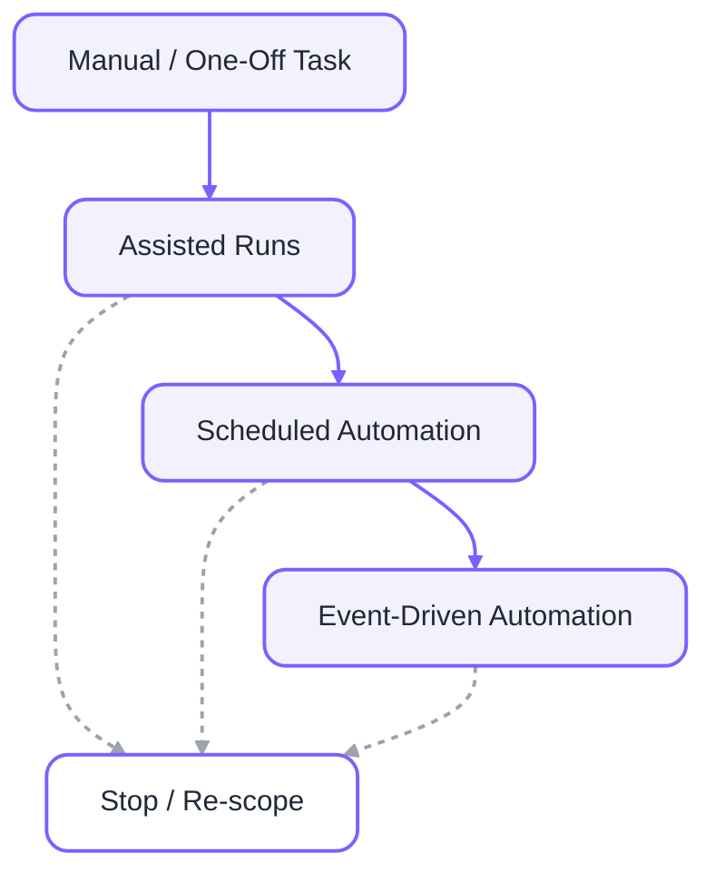

## The Core Idea

Cloud agents are powerful, but the real skill is **governance**: knowing what should be manual, assisted, or automated.

<Info>
  If you want the taxonomy first, including more information on trigger types + governance levels, check out the [Cloud Agents Taxonomy guide](/guides/cloud-agents/cloud-agents-taxonomy).
</Info>

## The Cloud Agent Trust Ladder

<Info>
    Most teams should spend the most time in **Assisted** mode. That’s where trust compounds.
</Info>

## Stage 1: Manual Tasks (Human-Triggered)

    *Goal: Learn the pattern and define review criteria.*

    What you do
        - Dispatch a task
        - Review the output carefully
        - Capture what “good” looks like

    Exit criteria
        - You can describe expected output in plain language
        - Failures are understandable (not mysterious)
        - The work is clearly recurring

⸻

## Stage 2: Assisted Runs (Auto-run, Human Approval)
*Goal: Reduce handling cost without increasing risk.*

What changes
- The agent runs based on a trigger (schedule/event)
- A human reviews outcomes before merge/action

Best practices
    - Require PRs/diffs as outputs
    - Use checklists for review
    - Keep blast radius small (one repo, one class of issues)

⸻

## Stage 3: Scheduled Automation

*Goal: Prevent backlog by handling predictable work on a cadence.*

Best fits
    - dependency hygiene
    - weekly security remediation
    - routine cleanup

Guardrails
    - bounded scope
    - predictable triggers
    - clear rollback path

⸻

## Stage 4: Event-Driven Automation
*Goal: Respond quickly to high-signal events.*

Best fits
    - high-severity security findings
    - production regressions with clear patterns
    - incident triage summaries

Guardrails
    - tight scope
    - rapid feedback loops
    - human review of outcomes

## Common Cloud Agent Failure Modes (and Fixes)
<AccordionGroup>
  <Accordion title="Failure: Automating before review criteria exist">
    **Fix:** Start manual. Write explicit acceptance criteria. Move to assisted only after you can review quickly.
  </Accordion>
    <Accordion title="Failure: Too broad a scope" >
    **Fix:** Restrict to one repo, one class of issues, one trigger.
  </Accordion>
    <Accordion title="Failure: No clear owner" >
    **Fix:** Assign ownership before automation. Automation without ownership creates invisible work.
  </Accordion>
    <Accordion title="Failure: Outputs aren’t reviewable">
    **Fix:** Prefer PRs, diffs, and reports over “actions taken silently.”
  </Accordion>
</AccordionGroup>

