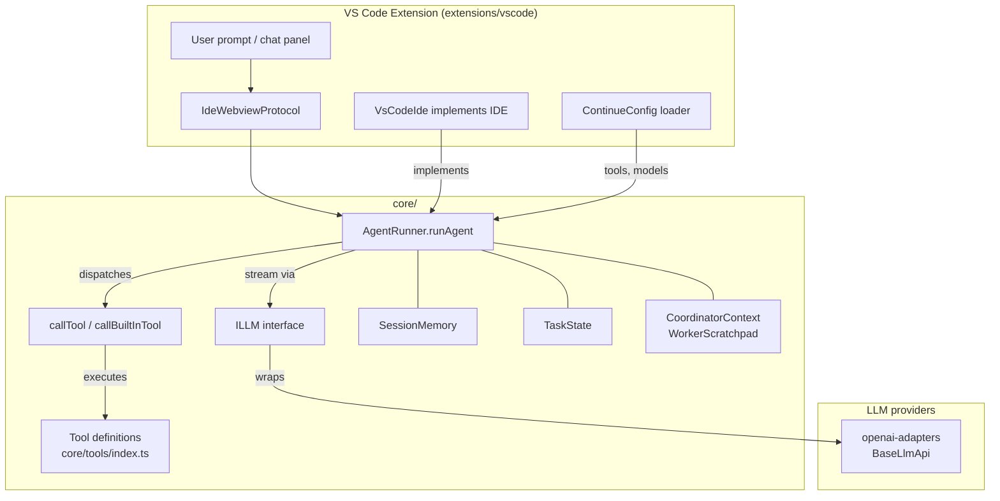
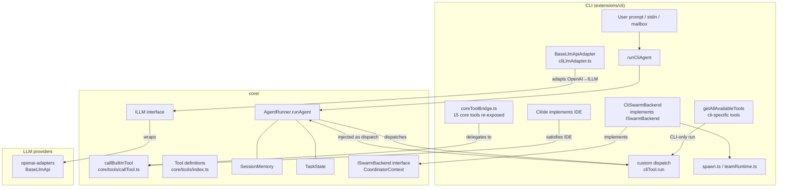

# Core Sharing Architecture

Both the VS Code extension and the CLI delegate to the same `core/` package for LLM streaming, the autonomous agent loop, tool dispatch, and coordinator context. This page shows, at a glance, what each runtime owns and what they share.

---

## VS Code extension → core

The VS Code extension constructs an `ILLM` instance (via `BaseLlmApi`) and passes it directly into `runAgent`. `VsCodeIde` satisfies the `IDE` interface that `callBuiltInTool` uses for file I/O. All 50-turn agent loop logic, denial tracking, and session memory extraction live in `core/` untouched.

---

## CLI → core

The CLI does not duplicate the agent loop. `runCliAgent` (Phase 4) wires three adapters into `core/agent/AgentRunner.runAgent`:

| Adapter             | Maps                         | To                                        |
| ------------------- | ---------------------------- | ----------------------------------------- |
| `BaseLlmApiAdapter` | `BaseLlmApi` + `ModelConfig` | `ILLM` expected by `AgentRunner`          |
| `CliIde`            | CLI filesystem / shell       | `IDE` interface used by `callBuiltInTool` |
| custom `dispatch`   | `CliTool.run()` callback     | `AgentRunConfig.dispatch` override        |

`coreToolBridge.ts` re-exposes 15 core built-in tools inside the CLI's own tool registry so both runtimes execute identical tool implementations from `core/tools/`. CLI-specific tools (shell, git, swarm, etc.) keep their own `run()` implementations and are injected via the `dispatch` override.

---

## What is shared

| Concern                                                        | Module                                         | VS Code |       CLI       |
| -------------------------------------------------------------- | ---------------------------------------------- | :-----: | :-------------: |
| Autonomous agent loop (50-turn, denial tracking, error limits) | `core/agent/AgentRunner.ts`                    |    ✓    |        ✓        |
| Session memory extraction                                      | `core/agent/SessionMemory.ts`                  |    ✓    |        ✓        |
| Task state machine                                             | `core/agent/TaskState.ts`                      |    ✓    |        ✓        |
| Built-in tool implementations (read, edit, search, grep, …)    | `core/tools/`                                  |    ✓    |        ✓        |
| Tool definitions (name / description / schema)                 | `core/tools/index.ts`                          |    ✓    |        ✓        |
| Coordinator scratchpad format                                  | `core/agent/coordinator/CoordinatorContext.ts` |    ✓    |        ✓        |
| Swarm backend interface                                        | `core/agent/coordinator/ISwarmBackend.ts`      |    —    |  ✓ (CLI impl)   |
| ILLM streaming interface                                       | `core/index.d.ts`                              |    ✓    | ✓ (via adapter) |

## What is runtime-specific

| Concern            | VS Code                   | CLI                                       |
| ------------------ | ------------------------- | ----------------------------------------- |
| IDE interface impl | `VsCodeIde`               | `CliIde`                                  |
| LLM adapter        | native `ILLM` from config | `BaseLlmApiAdapter` wrapping `BaseLlmApi` |
| Tool dispatch      | `callTool` (default)      | custom `dispatch` via `cliTool.run()`     |
| Swarm spawning     | —                         | `CliSwarmBackend` (process / tmux)        |
| UI / protocol      | IPC webview               | stdin / stdout / TUI                      |
