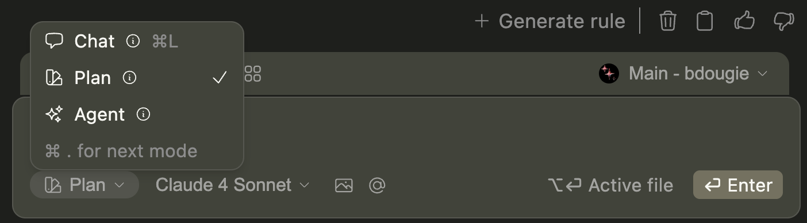

Plan Mode prevents unintentional file modifications, letting you think through solutions and build confidence before committing to action. The core principle is understand before you change, giving you a research-first approach that prevents costly mistakes and creates better architectural decisions.

<Accordion title="Learn how to choose the right mode" icon="lightbulb">
     <Columns cols={3}>
  <Card title="Chat Mode" icon="comments">
      *Learn and discuss without changing code.*

    **Mental Model:** Talking to a knowledgeable colleague
    **Best For:** Explaining concepts, comparing approaches, code review discussions.

  </Card>

  <Card title="Plan Mode" icon="binoculars">
      *Safely explore and plan with read-only tools.*

    **Mental Model:** Architect surveying before renovation
    **Best For:** Understanding a codebase, bug investigation, planning implementations.

  </Card>

  <Card title="Agent Mode" icon="hammer">
  *Make actual changes with full tool access.*

    **Mental Model:** Contractor executing approved blueprints
    **Best For:** Implementing features, fixing bugs, running tests and commands.

  </Card>
</Columns>
  </Accordion>

## What Are the Use Cases for Plan Mode

Plan Mode excels in four key scenarios where understanding before acting prevents expensive mistakes:

<Columns cols={2}>
  <Card title="Codebase Exploration" icon="map">
    Navigate unfamiliar systems and trace data flows without modification risk.
    
    [See exploration prompts →](#prompt-library)
  </Card>

  <Card title="Implementation Planning" icon="clipboard-list">
    Map dependencies and sequence complex changes before execution.  

[See planning prompts →](#prompt-library)

  </Card>

  <Card title="Issue Investigation" icon="magnifying-glass">
    Debug systematically by tracing execution paths and analyzing root causes.{" "}

[See debugging prompts →](#prompt-library)

  </Card>

  <Card title="Architecture Analysis" icon="building">
    Assess system health, identify bottlenecks, and plan improvements.
    
    [See analysis prompts →](#prompt-library)
  </Card>
</Columns>

## What Are the Best Practices for Plan Mode?

### How to Plan Faster

1. **Scope your requests**: `Focus analysis on the user authentication module only, ignore the admin features`
2. **Use targeted context**: `Analyze @Files and its direct imports for security issues`

### How to Create Higher Quality Plans

1. **Provide business context**: `This feature needs to handle Black Friday traffic (10x normal load). Plan accordingly.`
2. **Share technical constraints**: `We're on AWS with strict security requirements. Plan a file upload system that meets SOC2 compliance.`
3. **Ask for risk analysis**: `What could go wrong with this database migration? Plan rollback procedures.`
4. **Request multiple perspectives**: `Show me 3 different approaches to implementing caching in this API, with pros and cons for each.`

## How to Enable Plan Mode

You can switch to `Plan` in the mode selector below the chat input box.

## What Tools Are Available in Plan Mode?

| Tool                              | Available | Description                                          |
| :-------------------------------- | :-------- | :--------------------------------------------------- |
| **File/directory reading**        | ✅        | Browse and read any file or folder in your workspace |
| **Grep/glob search**              | ✅        | Search for patterns across files and directories     |
| **Repository structure analysis** | ✅        | Understand codebase organization and dependencies    |
| **Git history/diffs**             | ✅        | Review commits, branches, and changes                |
| **Web content fetching**          | ✅        | Access external documentation and resources          |
| **External API access**           | ✅        | Read-only calls to external services                 |
| **MCP tools**                     | ✅        | Model Context Protocol integrations                  |
| **Database schema examination**   | ✅        | Analyze database structure (read-only)               |
| **File creation/editing**         | ❌        | Creating or modifying files                          |
| **Terminal command execution**    | ❌        | Running shell commands                               |
| **System modifications**          | ❌        | Changing system settings or configurations           |
| **Package installation**          | ❌        | Installing dependencies or packages                  |
| **Git commits/pushes**            | ❌        | Making changes to version control                    |
| **Database modifications**        | ❌        | Altering database data or structure                  |

## How Context Integration Works in Plan Mode

Context is the foundation of effective planning. Without proper context, AI models fall back on generic patterns, leading to plans that don't fit your specific system. Continue's [context system](/ide-extensions/chat/context-selection) transforms broad suggestions into actionable strategies:

| Context Type         | Usage                                                  | Best For                      |
| :------------------- | :----------------------------------------------------- | :---------------------------- |
| **Highlighted Code** | `cmd/ctrl + L` (VS Code) or `cmd/ctrl + J` (JetBrains) | Component-specific analysis   |
| **Active File**      | `opt/alt + enter` when sending request                 | Current file context          |
| **@Files**           | `@Files package.json tsconfig.json`                    | Specific file analysis        |
| **@Terminal**        | `@Terminal`                                            | Debugging with output         |
| **@Git Diff**        | `@Git Diff`                                            | Change impact analysis        |

<Accordion title="Advanced Context Examples">
<AccordionGroup>
  <Accordion title="Component Analysis">
    **After highlighting a React component**:
    `Analyze this component for performance bottlenecks and plan optimization strategies.`
  </Accordion>

<Accordion title="Configuration Review">
  `@Files docker-compose.yml Dockerfile - Review our containerization setup and
  suggest improvements for production deployment.`
</Accordion>

<Accordion title="API Design Review">
  `@Folder src/api - Evaluate our REST API design patterns and identify
  opportunities for better consistency.`
</Accordion>

  <Accordion title="Cross-Platform Migration">
    `@Codebase - Plan a strategy to migrate this web app to also support mobile using React Native.`
  </Accordion>
</AccordionGroup>
</Accordion>

## Prompt Library

### Codebase Exploration

<AccordionGroup>
  <Accordion title="Understanding Systems">
    **Data Flow Analysis**:
    `Help me understand how state management works in this Redux app. Map out the data flow from actions to components.`

    **Microservices Communication**:
    `Analyze how our microservices communicate and identify potential bottlenecks in service-to-service calls.`

    **Database Schema Review**:
    `Examine the database schema and relationships to understand how user data is structured and accessed.`

  </Accordion>

  <Accordion title="Legacy Code Investigation">
    **System Mapping**:
    `Map out this legacy codebase architecture. What are the main components and how do they communicate?`

    **Technical Debt Assessment**:
    `Analyze this codebase for technical debt hotspots and maintenance pain points.`

    **Modernization Planning**:
    `Assess this legacy system and recommend modernization opportunities that provide the highest impact with lowest risk.`

  </Accordion>
</AccordionGroup>

### Implementation Planning

<AccordionGroup>
  <Accordion title="Migrations & Upgrades">
    **Cloud Migration**:
    `Plan a migration from on-premise servers to AWS, considering our current Node.js application architecture.`

    **Package Manager Migration**:
    `Create a plan to migrate from npm to pnpm, analyzing dependencies and potential breaking changes.`

    **Monorepo Conversion**:
    `Plan how to convert our multiple repositories into a single monorepo using Nx or Lerna.`

  </Accordion>

  <Accordion title="Refactoring & Integration">
    **Service Extraction**:
    `Plan a refactor to extract shared authentication logic into a reusable service across these microservices.`

    **Payment Integration**:
    `We need to add Stripe payments to this e-commerce app. Plan the integration considering our current architecture.`

    **API Migration**:
    `@Codebase - Plan a migration from REST to GraphQL across our entire API.`

  </Accordion>
</AccordionGroup>

### Issue Investigation

<AccordionGroup>
  <Accordion title="Performance Problems">
    **Dashboard Performance**:
    `Users report slow page loads on the dashboard. Investigate performance bottlenecks in the @Files and related components.`

    **API Optimization**:
    `Plan a performance optimization strategy for this Node.js API, focusing on database queries and caching.`

    **Bundle Analysis**:
    `Analyze this React app for performance bottlenecks. What are the most expensive operations?`

  </Accordion>

  <Accordion title="Bug Investigation">
    **Race Condition Analysis**:
    `Users occasionally see stale data in the UI. Investigate potential race conditions in our async data fetching.`

    **Production Incidents**:
    `@Git Diff We're seeing 500 errors in production. Analyze recent changes and identify what might be causing the issue.`

    **Deployment Issues**:
    `Our staging environment works fine, but production deployments fail. Analyze environment differences.`

  </Accordion>
</AccordionGroup>

### Architecture Analysis

<AccordionGroup>
  <Accordion title="Scalability & Performance">
    **Traffic Planning**:
    `Analyze this @codebase architecture and identify potential bottlenecks for handling 10x more traffic.`

    **CDN Implementation**:
    `Plan a CDN strategy for our global user base, considering asset optimization and edge caching.`

    **Caching Strategy**:
    `Show me 3 different approaches to implementing caching in this API, with pros and cons for each.`

  </Accordion>

  <Accordion title="Security & Compliance">
    **Security Audit**:
    `Audit this API for security vulnerabilities, focusing on authentication, authorization, and data validation.`

    **Threat Modeling**:
    `Model potential security threats for this user registration flow and plan mitigation strategies.`

    **Compliance Planning**:
    `Plan GDPR compliance implementation for this user data handling system.`

  </Accordion>
</AccordionGroup>

## How to Transition From Plan to Execution

### When to Transition to Agent Mode

Move to Agent Mode when you have:

✅ **Clear understanding** of the current system  
✅ **Detailed implementation plan** with specific steps  
✅ **Risk assessment** and mitigation strategies  
✅ **Team approval** (if required)  
✅ **Success criteria** defined

### Key Takeaways

The three-mode system—Chat mode for learning, Plan mode for strategy, and Agent mode for execution—provides a complete development workflow that scales from simple bug fixes to complex system architecture.

**Remember:**

- Choose the right mode for each task
- Start broad, then focus your planning sessions for better results
- Transition to Agent mode with clear execution steps

The best code is planned code.
