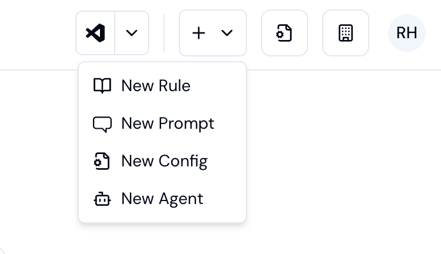
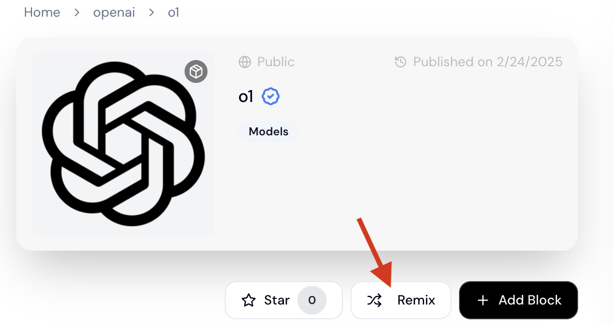

[Continue Hub](https://hub.continue.dev) is your central platform for AI-powered development. Discover pre-built configurations, create custom agents, and manage components that power your coding workflow.

## What You Can Do on the Hub

<CardGroup cols={2}>

  <Card title="Create and Use Configs" icon="folder-gear" href="/hub/configs/intro">

    Use a combinations of models, tools, and rules for different coding contexts. [Learn more &rarr;](/hub/configs/intro)

  </Card>

  <Card title="Create and Run Agents" icon="robot" href="/hub/workflows/intro">

   Run background agents that complete tasks automatically in your repositories. [Learn more &rarr;](/hub/workflows/intro)

  </Card>

</CardGroup>

## Hub Components

Both configs and agents are built from reusable components that you can create, share, and customize:

<CardGroup cols={2}>

  <Card title="Models" icon="cube">

    Large Language Models from various providers (OpenAI, Anthropic, etc.) configured for specific roles like chat, autocomplete, or editing

  </Card>

  <Card title="MCPs" icon="wrench">

    Model Context Protocol servers that provide tools and capabilities like database access, web search, or custom functions

  </Card>

  <Card title="Rules" icon="shield">

    Guidelines that shape AI behavior - coding standards, constraints, or specific instructions for your domain

  </Card>

  <Card title="Prompts" icon="message-square">

    Reusable instructions for common tasks, optimized for specific workflows or coding patterns

  </Card>

</CardGroup>

## Creating Components

<Tip>

  Components are the building blocks used in both configs and agents. When you create a component on the hub, it becomes available for use in any config or agent.

</Tip>

<CardGroup cols={2}>

  <Card title="Create New" icon="plus">

    Start with a blank template:

    - Select New Rules, Prompts, Configs, or Agents from the Hub navigation
    - Click 'New' to start with a blank template
    - Configure by filling in the inputs to create your markdown configuration
        

  </Card>

  <Card title="Remix Existing" icon="copy">

    Customize an existing component:

    - Browse the [Hub](https://hub.continue.dev/) for what you need
    - Click 'Remix' to create a copy that you can customize
    - Modify the configuration for your specific needs
    - Save your customized version
        

  </Card>

</CardGroup>

### Component Permissions

Set visibility for your components:

- **Personal**: Only you can see and use
- **Public**: Anyone can discover and use
- **Organization**: Team members can access

### Component Inputs

Some components can receive values, including secrets, as inputs through templating. For values that the user needs to set, you can use template variables (e.g. `${{ inputs.API_KEY}}`). Then, the user can set `API_KEY: ${{ secrets.MY_API_KEY }}` in the `with` clause of their agent or config.

<Info>
**Choosing between `secrets.` and `inputs.`**

When creating blocks for the hub:
- Use `${{ inputs.INPUT_NAME }}` in your block definition when you want users to be able to customize which secret is used
- Users will then map their own secrets using `${{ secrets.SECRET_NAME }}` in the `with` clause

For personal or single-use configurations, you can skip the inputs layer and reference `${{ secrets.SECRET_NAME }}` directly in your block.
</Info>
