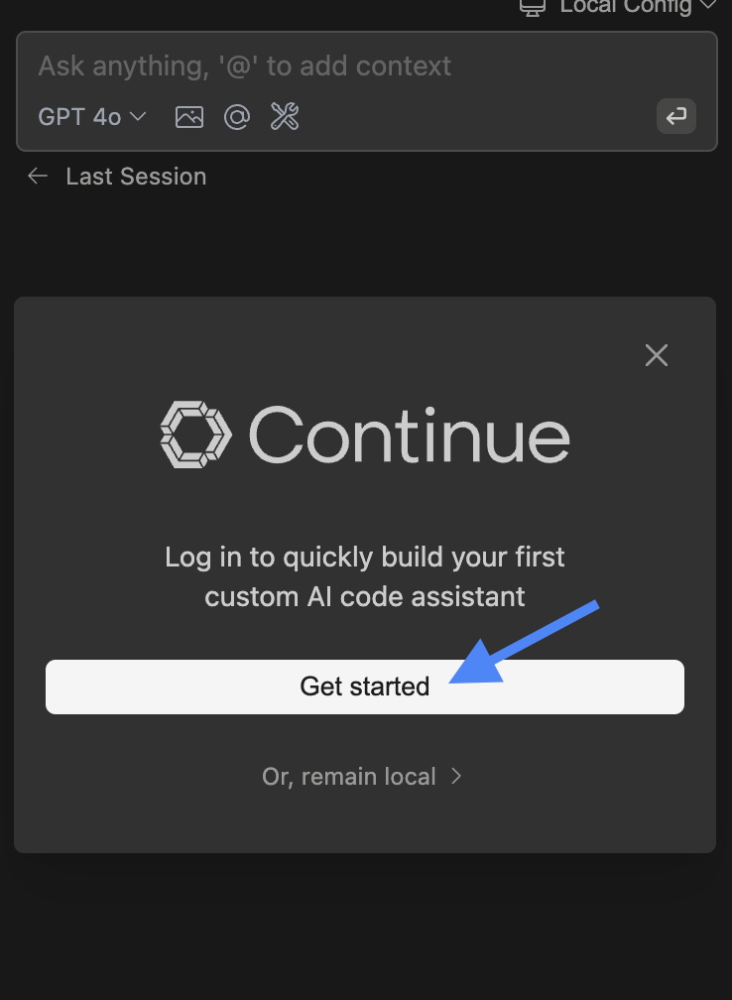

<iframe
  width="100%"
  height="400"
  src="https://www.youtube.com/embed/gjekTru4Cg4"
  title="Install Continue VS Code Extension"
  frameborder="0"
  allow="accelerometer; autoplay; clipboard-write; encrypted-media; gyroscope; picture-in-picture"
  allowfullscreen
></iframe>

<Tabs>
<Tab title="VS Code">

<Steps>
<Step title="Install from Marketplace">
Click `Install` on the [Continue extension page in the Visual Studio Marketplace](https://marketplace.visualstudio.com/items?itemName=Continue.continue)
</Step>

<Step title="Install in VS Code">
  This will open the Continue extension page in VS Code, where you will need to
  click `Install` again
</Step>

<Step title="Move to Right Sidebar">
The Continue logo will appear on the left sidebar. For a better experience, move Continue to the right sidebar

</Step>

<Step title="Sign In">
[Sign in to Mission Control](https://auth.continue.dev/) to get started
</Step>
</Steps>

<Info>
  If you have any problems, see the [troubleshooting guide](/troubleshooting) or
  ask for help in [our Discord](https://discord.gg/NWtdYexhMs)
</Info>

</Tab>

<Tab title="JetBrains">

<Steps>
<Step title="Open Settings">
Open your JetBrains IDE and open **Settings** using `Ctrl` + `Alt` + `S`
</Step>

<Step title="Find Continue Plugin">
  Select **Plugins** on the sidebar and search for "Continue" in the marketplace
</Step>

<Step title="Install Plugin">
Click `Install`, which will cause the Continue logo to show up on the right toolbar

</Step>

<Step title="Sign In">
[Sign in to Mission Control](https://auth.continue.dev/) to get started
</Step>
</Steps>

<Info>
  If you have any problems, see the [troubleshooting guide](/troubleshooting) or
  ask for help in [our Discord](https://discord.com/invite/EfJEfdFnDQ)
</Info>

</Tab>
</Tabs>

## Signing in

Click "Get started" to sign in to Mission Control and get started.

