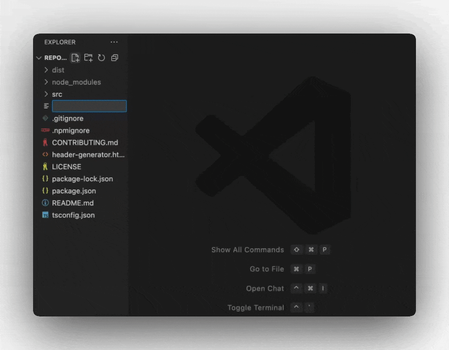

Welcome to Continue! This interactive tutorial will guide you through all four core features using practical examples. Follow along step-by-step to learn more about Continue's capabilities.

<Info>
  **Prerequisites**: Make sure you have [installed
  Continue](/ide-extensions/install) and [signed
  in](https://auth.continue.dev/) to get started.
</Info>

---

## 🔄 Autocomplete

**What it does**: Provides intelligent inline code suggestions as you type, powered by AI.

<Steps>
<Step title="Create a Test File">
Create a new file called `tutorial.js` (or use any language you prefer) in your IDE
</Step>

<Step title="Try Autocomplete">
Copy this starter code and place your cursor at the end of the comment:

```javascript
// TODO: Implement a sorting algorithm function
function sortingAlgorithm(arr) {
  // Place cursor here and press Enter
}
```

Press **Enter** and watch Continue suggest code completions. Press **Tab** to accept suggestions.

</Step>

<Step title="See the Magic">
Continue will intelligently suggest function implementations based on the context and comment.
</Step>
</Steps>

<Tip>
  Autocomplete works best when you provide clear function names, comments, or
  type annotations that give context about your intent.
</Tip>

---



## ✏️ Edit

**What it does**: Make quick, targeted changes to specific code sections using natural language instructions.

<Steps>
<Step title="Add Sample Code">
Paste this bubble sort implementation in your file:

```javascript
function sortingAlgorithm(x) {
  for (let i = 0; i < x.length; i++) {
    for (let j = 0; j < x.length - 1; j++) {
      if (x[j] > x[j + 1]) {
        let temp = x[j];
        x[j] = x[j + 1];
        x[j + 1] = temp;
      }
    }
  }
  return x;
}
```

</Step><Step title="Highlight the Function">
**Highlight** the entire function in your editor
</Step>

<Step title="Open Edit Mode">Press **Cmd/Ctrl + I** to open Edit mode</Step>

<Step title="Give Instructions">
  Type: `"make this more readable and add TypeScript types"`
</Step>

<Step title="Watch the Magic">
  Watch Continue refactor your code automatically!
</Step>

<Step title="Review Changes">
Continue will show you a diff of the proposed changes. Accept or reject individual changes as needed.
</Step>
</Steps>

<Note>
  Edit is perfect for refactoring, adding documentation, fixing bugs, or
  converting between languages/frameworks.
</Note>


## 💬 Chat Mode

**What it does**: Interactive AI assistant that can analyze code, answer questions, and provide guidance without leaving your IDE.

<Steps>
<Step title="Add Another Function">
Add this second sorting function to your file:

```javascript
function sortingAlgorithm2(x) {
  for (let i = 0; i < x.length; i++) {
    for (let j = 0; j < x.length - 1; j++) {
      if (x[j] > x[j + 1]) {
        let temp = x[j];
        x[j] = x[j + 1];
        x[j + 1] = temp;
      }
    }
  }
  return x;
}
```

</Step>
<Step title="Start a Conversation">
1. **Highlight** the function 
2. Use the keyboard shortcuts below to add it to Chat.
3. Ask: `"What sorting algorithm is this and how can I optimize it?"`
</Step>

<Step title="Explore Further">
Try these follow-up questions:
- `"Show me how to implement quicksort instead"`
- `"What's the time complexity of this algorithm?"`
- `"Can you write unit tests for this function?"`
</Step>
</Steps>

### Chat Mode Keyboard Shortcuts

<Tabs>
<Tab title="VS Code">

**Cmd/Ctrl + L**  
New Chat / New Chat With Selected Code / Close Continue Sidebar If Chat Already In Focus

**Cmd/Ctrl + Shift + L**  
Focus Current Chat / Add Selected Code To Current Chat / Close Continue Sidebar If Chat Already In Focus

</Tab>
<Tab title="JetBrains IDEs">

**Cmd/Ctrl + J**  
New Chat / New Chat With Selected Code / Close Continue Sidebar If Chat Already In Focus

**Cmd/Ctrl + Shift + J**  
Focus Current Chat / Add Selected Code To Current Chat / Close Continue Sidebar If Chat Already In Focus

</Tab>
</Tabs>

<Tip>
  Use Chat for code reviews, debugging help, learning new concepts, or
  brainstorming solutions to complex problems.
</Tip>


---

## 🤖 Agent Mode

**What it does**: An autonomous coding assistant that can read files, make changes, run commands, and handle complex multi-step tasks.

<Steps>
<Step title="Switch to Agent Mode">
1. Open the Continue panel
2. Click the **dropdown** in the bottom left of the input box
3. Select **"Agent"** mode
</Step>

<Step title="Give Agent Mode a Complex Task">
  Try this prompt: ``` "Write comprehensive unit tests for the sorting functions
  in this file. Create the tests in a new file using Jest, and make sure to test
  edge cases like empty arrays and single elements." ```
</Step>

<Step title="Watch Agent Mode Work">
Agent mode will:
- ✅ Analyze your existing code
- ✅ Create a new test file
- ✅ Write comprehensive tests
- ✅ Handle setup and imports
- ✅ Explain what it's doing at each step
</Step>
</Steps>

<Warning>
  Agent mode has powerful capabilities including file creation and modification.
  Always review Agent mode's changes before accepting them.
</Warning>


---
## Explore More Extension Examples

Ready to explore more? Continue offers five powerful features to enhance your coding workflow:
<Tabs>
<Tab title="Agent Mode">
[Agent Mode](/ide-extensions/agent/quick-start) equips the Chat model with the tools needed to handle a wide range of coding tasks


<Info>
  Learn more about [Agent Mode](/ide-extensions/agent/quick-start)
</Info>
</Tab>

<Tab title="Chat Mode">
[Chat](/ide-extensions/chat/quick-start) makes it easy to ask for help from an LLM without needing to leave the IDE


<Info>
  Learn more about [Chat Mode](/ide-extensions/chat/quick-start)
</Info>
</Tab>

<Tab title="Plan">
[Plan](/ide-extensions/agent/plan-mode) provides a safe environment with read-only tools for exploring code and planning changes


<Info>
  Learn more about [Plan Mode](/ide-extensions/agent/plan-mode)
</Info>
</Tab>

<Tab title="Edit">
[Edit](/ide-extensions/edit/quick-start) is a convenient way to modify code without leaving your current file


<Info>
  Learn more about [Edit](/ide-extensions/edit/quick-start)
</Info>
</Tab>

<Tab title="Autocomplete">
[Autocomplete](/ide-extensions/autocomplete/quick-start) provides inline code suggestions as you type


<Info>
  Learn more about [Autocomplete](/ide-extensions/autocomplete/quick-start)
</Info>
</Tab>
</Tabs>

## 🚀 Next Steps

Congratulations! You've experienced all four core Continue features. Here's what to explore next:

<CardGroup cols={2}>
  <Card title="Customize Your Setup" icon="gear" href="/customize/overview">
    Configure models, add context providers, and personalize your workflow
  </Card>
  <Card
    title="Advanced Features"
    icon="rocket"
    href="/ide-extensions/agent/quick-start"
  >
    Dive deeper into Agent mode capabilities and advanced use cases
  </Card>
  <Card
    title="Model Providers"
    icon="brain"
    href="/customize/model-providers/overview"
  >
    Connect your preferred AI models and providers
  </Card>
  <Card
    title="Join Community"
    icon="users"
    href="https://discord.gg/NWtdYexhMs"
  >
    Get help and share experiences with other Continue users
  </Card>
</CardGroup>

---

## 📚 Feature Deep Dives

Ready to master specific features? Check out these detailed guides:

<AccordionGroup>
  <Accordion title="Autocomplete Deep Dive">
    Learn about [configuring autocomplete
    models](/customize/model-roles/autocomplete), [fine-tuning
    suggestions](/customize/deep-dives/autocomplete), and [troubleshooting
    common issues](/troubleshooting).
  </Accordion>

<Accordion title="Chat & Agent Mode Best Practices">
  Discover [effective prompting techniques](/customize/deep-dives/prompts), [hub
  v. local configuration](/guides/understanding-configs), and [custom slash
  commands](/customize/deep-dives/prompts).
</Accordion>

  <Accordion title="Enterprise & Teams">
    Explore [Hub configurations](/mission-control/configs/intro), [organization
    management](/mission-control/governance/creating-an-org), and [sharing
    configurations](/mission-control/sharing).
  </Accordion>
</AccordionGroup>

<Info>
  **Need help?** Check our [troubleshooting guide](/troubleshooting) or ask a
  question in our [community
  discussions](https://github.com/continuedev/continue/discussions).
</Info>
