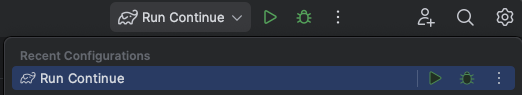

# Contributing to Continue (JetBrains extension) <!-- omit in toc -->

This file is for contribution guidelines specific to the JetBrains extension. See the root [`CONTRIBUTING.md`](../../CONTRIBUTING.md) for general contribution guidelines.

## Table of Contents <!-- omit in toc -->

- [Architecture Overview](#architecture-overview)
- [Environment Setup](#environment-setup)
  - [IDE Installation](#ide-installation)
  - [IDE configuration](#ide-configuration)
  - [Node.js Requirements](#nodejs-requirements)
  - [Install all dependencies](#install-all-dependencies)
  - [Misc](#misc)
- [Development Workflow](#development-workflow)
  - [Running the extension](#running-the-extension)
  - [Reloading changes](#reloading-changes)
  - [Setting breakpoints](#setting-breakpoints)
  - [Available Gradle tasks](#available-gradle-tasks)
  - [Packaging](#packaging)
    - [Testing the packaged extension](#testing-the-packaged-extension)

## Architecture Overview

This extension shares much of the code with the VS Code extension by utilizing shared code in the `core` directory and
packaging it in a binary in the `binary` directory. Communication occurs over stdin/stdout.

## Environment Setup

### IDE Installation

We recommend using IntelliJ IDEA, which you can download from
the [JetBrains website](https://www.jetbrains.com/idea/download).

Both Ultimate and Community (free) editions are suitable for this project. Continue is built with JDK version 17, as
specified in [`./build.gradle.kts`](./build.gradle.kts).

### IDE configuration

- Enable code formatting on save: `Settings | Tools | Actions on Save | Reformat code`

### Node.js Requirements

This project requires Node.js version 20.11.0 (LTS) or higher. You have two options for installation:

1. Download and install directly from [nodejs.org](https://nodejs.org/en/download).
2. If you're using NVM (Node Version Manager), set the correct Node.js version for this project by running `nvm use` in
   the project root.

### Install all dependencies

- Unix: `./scripts/install-dependencies.sh`
- Windows: `.\scripts\install-dependencies.ps1`

### Misc

- Ensure that you have the Gradle plugin installed

## Development Workflow

Because the `gui` and `core` are written in TypeScript, our development workflow is built around the assumption that you
have VS Code installed.

### Running the extension

- Open the project in VS Code and star the `Core binary` task
- Switch back to Intellij and select the "Run Continue" configuration in the top-right corner of the IDE
- Click the "Debug" button
  - The first time running this will install the IDE version specified by the `platformVersion` property in [
    `./run/Run Extension.run.xml`](./.run/Run%20Extension.run.xml). This will take a moment as the installation size
    can be close to 1GB.

\

This should open a new instance on IntelliJ with the extension installed and connected via TCP to the server started
through the `Core binary` task.

### Reloading changes

- `extensions/intellij`: Attempt to reload changed classes by selecting
  _Run | Debugging Actions | Reload Changed Classes`_
  - This will often fail on new imports, schema changes etc. In that case, you need to stop and restart the extension
- `gui`: Changes will be reloaded automatically
- `core`: Run `npm run build` from the `binary` directory and restart the `Core binary` task in VS Code

### Setting breakpoints

- `extensions/intellij`: Breakpoints can be set in Intellij
- `gui`: You'll need to set explicit `debugger` statements in the source code, or through the browser dev tools
- `core`: Breakpoints can be set in VS Code (requires restarting the _Core Binary_ task)

### Available Gradle tasks

To see the list of Gradle tasks available, you can run the following:

```shell
./gradlew tasks
```

A handful of the most relevant tasks are outlined below:

```shell
build - Assembles and tests this project.
clean - Deletes the build directory.
dependencies - Displays all dependencies declared in root project 'continue-intellij-extension'
runIde - Runs the IDE instance with the developed plugin installed.
verifyPluginConfiguration - Checks if Java and Kotlin compilers configuration meet IntelliJ SDK requirements
```

### Packaging

- Unix: `./gradlew buildPlugin`
- Windows: `./gradlew.bat buildPlugin`

This will generate a .zip file in `./build/distributions` with the version defined in [`./gradle.properties`](./gradle.properties)

#### Testing the packaged extension

- Navigate to the Plugins settings page (_Settings | Plugins_)
- Click on the gear icon
- Click _Install from disk_ and select the ZIP file in `./build/distributions`
