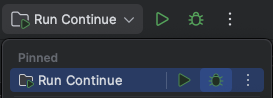

# Contributing to Continue (JetBrains extension) <!-- omit in toc -->

This file is for contribution guidelines specific to the JetBrains extension. See the root [
`CONTRIBUTING.md`](../../CONTRIBUTING.md) for general contribution guidelines.

## Table of Contents <!-- omit in toc -->

- [Architecture Overview](#architecture-overview)
- [Environment Setup](#environment-setup)
    - [IDE Installation](#ide-installation)
    - [IDE configuration](#ide-configuration)
    - [Node.js Requirements](#nodejs-requirements)
    - [Install all dependencies](#install-all-dependencies)
    - [Misc](#misc)
- [Development Workflow](#development-workflow)
    - [Running the extension in debug mode](#running-the-extension-in-debug-mode)
    - [Accessing files in the `.continue` directory](#accessing-files-in-the-continue-directory)
    - [Viewing logs](#viewing-logs)
    - [Reloading changes](#reloading-changes)
    - [Setting breakpoints](#setting-breakpoints)
    - [Available Gradle tasks](#available-gradle-tasks)
    - [Packaging](#packaging)
        - [Installing the packaged extension](#installing-the-packaged-extension)
- [Testing](#testing)
    - [e2e testing](#e2e-testing)
        - [Overview](#overview)
        - [Setup](#setup)
        - [Running the tests](#running-the-tests)
        - [Identifying selectors](#identifying-selectors)

## Architecture Overview

This extension shares much of the code with the VS Code extension by utilizing shared code in the `core` directory and
packaging it in a binary in the `binary` directory. Communication occurs over stdin/stdout.

## Environment Setup

### IDE Installation

Continue is built with JDK version 17 (as specified in [`./build.gradle.kts`](./build.gradle.kts)), which can be
downloaded from [Oracle](https://www.oracle.com/java/technologies/javase/jdk17-archive-downloads.html).

We recommend using IntelliJ IDEA, which you can download from
the [JetBrains website](https://www.jetbrains.com/idea/download).

Both Ultimate and Community (free) editions are suitable for this project, although Ultimate has better debugging (see
notes below).

### IDE configuration

- Enable code formatting on save: `Settings | Tools | Actions on Save | Reformat code`

### Node.js Requirements

This project requires Node.js version 20.11.0 (LTS) or higher. You have two options for installation:

1. Download and install directly from [nodejs.org](https://nodejs.org/en/download).
2. If you're using NVM (Node Version Manager), set the correct Node.js version for this project by running `nvm use` in
   the project root.

### Install all dependencies

- Unix: `./scripts/install-dependencies.sh`
- Windows: `.\scripts\install-dependencies.ps1`

### Misc

- Ensure that you have the Gradle plugin installed

## Development Workflow

### Running the extension in debug mode

Select the `Run Continue` task in the top right corner of the IDE and then select the "Debug" option.

> In community edition, use `Run Continue (CE)` instead, which uses shell scripts instead of Ultimate-only node configs.
> If you want to debug the core in CE, you'll need to quit the `Start Core Dev Server (CE)` process and run the core in
> a
> different environment that supports debugging, such as VS Code (Launch "Core Binary").



This should open a new instance on IntelliJ with the extension installed.

### Accessing files in the `.continue` directory

When running the `Start Core Dev Server` task, we set the location of your Continue directory to
`./extensions/.continue-debug`. This is to
allow for changes to your `config.json` and other files during development, without affecting your actual configuration.

### Viewing logs

When using the `Run Continue` task, we automatically tail both prompt logs and IDE logs.

### Reloading changes

- `extensions/intellij`: Attempt to reload changed classes by selecting
  _Run | Debugging Actions | Reload Changed Classes`_
    - This will often fail on new imports, schema changes etc. In that case, you need to stop and restart the extension
- `gui`: Changes will be reloaded automatically
- `core`: Run `npm run build -- --os [darwin | linux | win32]` from the `binary` directory (requires
  restarting the
  `Start Core Dev Server` task)

### Setting breakpoints

- `extensions/intellij`: Breakpoints can be set in Intellij
- `gui`: You'll need to set explicit `debugger` statements in the source code, or through the browser dev tools
- `core`: Breakpoints can be set in Intellij (requires restarting the `Start Core Dev Server` task)
    - If you have Community Edition installed, you won't be able to use breakpoints in IntelliJ. Instead, you can start
      the `Core Binary` task in VS Code and set breakpoints in that IDE.

### Available Gradle tasks

To see the list of Gradle tasks available, you can run the following:

```shell
./gradlew tasks
```

A handful of the most relevant tasks are outlined below:

```shell
build - Assembles and tests this project.
clean - Deletes the build directory.
dependencies - Displays all dependencies declared in root project 'continue-intellij-extension'
runIde - Runs the IDE instance with the developed plugin installed.
verifyPluginConfiguration - Checks if Java and Kotlin compilers configuration meet IntelliJ SDK requirements
```

### Packaging

- Unix: `./gradlew buildPlugin`
- Windows: `./gradlew.bat buildPlugin`

This will generate a .zip file in `./build/distributions` with the version defined in [
`./gradle.properties`](./gradle.properties)

#### Installing the packaged extension

- Navigate to the Plugins settings page (_Settings | Plugins_)
- Click on the gear icon
- Click _Install from disk_ and select the ZIP file in `./build/distributions`

## Testing

### e2e testing

#### Overview

The e2e tests are written using [intellij-ui-test-robot](`https://github.com/JetBrains/intellij-ui-test-robot`). The
README for this project has a lot of helpful info on how to use the library.

Note that these tests fully take control of your mouse while executing.

#### Setup

If you are on macOS, you'll need to give IntelliJ permission to control your computer in order to run the e2e tests.
Open _System Settings_ and select `Privacy & Security` -> `Accessibility` and toggle the switch for IntelliJ.

#### Running the tests

Instantiate the test IDE as a background task:

```sh
./gradlew clean runIdeForUiTests &
```

Once the IDE has loaded, you can run the tests. Note that you need to have the test IDE focused in order for the tests
to run.

```sh
./gradlew test
```

#### Identifying selectors

While the `runIdeForUiTests` task is running, you can visit the following URL
to view the UI hierarchy of the running IDE:

http://127.0.0.1:8082/

#### Rebuilding the extension

To rebuild the extension with the latest source code, run the following:

```sh
./gradlew buildPlugin
```

This will update the contents of the extension that is loaded into the test IDE from
`build/idea-sandbox/plugins-uiTest/continue-intellij-extension`
