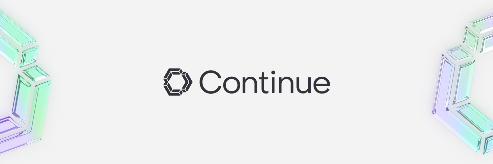
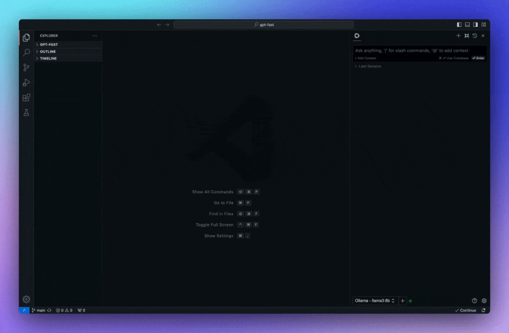

<!-- Plugin description -->

<h1 align="center">Continue</h1>

**[Continue](https://docs.continue.dev) is the leading open-source AI code assistant. You can connect any models and any context to build custom autocomplete and chat experiences inside [VS Code](https://marketplace.visualstudio.com/items?itemName=Continue.continue) and [JetBrains](https://plugins.jetbrains.com/plugin/22707-continue-extension)**

## Easily understand code sections

`cmd+J` (MacOS) / `ctrl+J` (Windows)

## Tab to autocomplete code suggestions

`tab` (MacOS) / `tab` (Windows)

## Refactor functions where you are coding

`cmd+I` (MacOS) / `ctrl+I` (Windows)

## Quickly use documentation as context

`@docs` (MacOS) / `@docs` (Windows)

## Getting Started

You can try out Continue with our free trial models before configuring your setup.

Learn more about the models and providers [here](https://continue.dev/docs/setup/overview).

## License

[Apache 2.0 © 2023 Continue Dev, Inc.](./LICENSE)

<!-- Plugin description end -->
