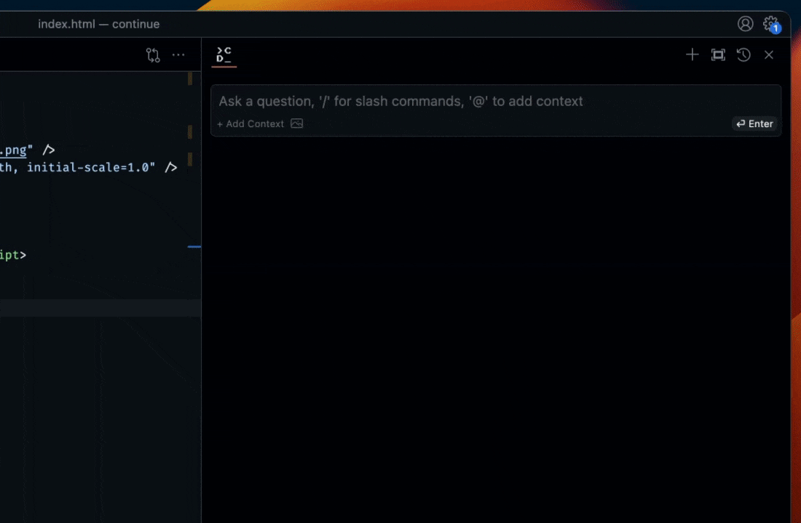
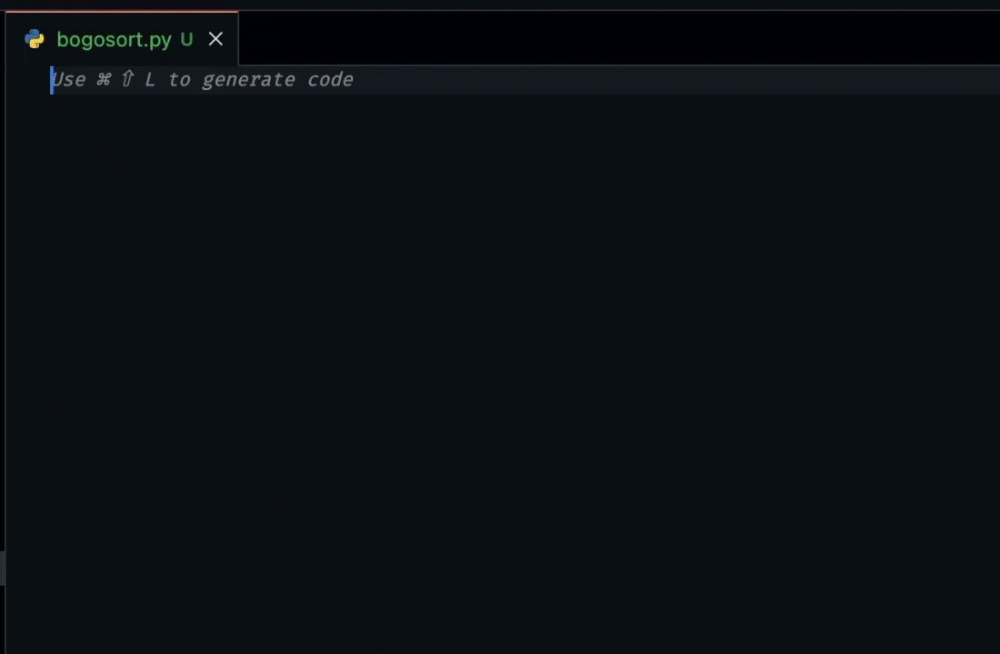
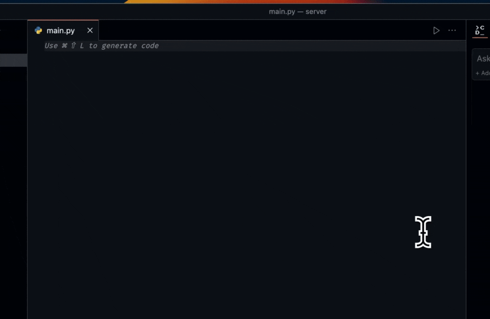

> 🎉 **Tab autocomplete now available in pre-release (experimental)**

<h1 align="center">Continue</h1>

**[Continue](https://docs.continue.dev) is an open-source autopilot for VS Code and JetBrains—the easiest way to code with any LLM**

# ⏩ Features

# 🔎 Ask about highlighted code

Highlight + select code sections and ask a question to get another perspective

- “how can I set up a Prisma schema that cascades deletes?”
- “where in the page should I be making this request to the backend?”
- “how can I communicate between these iframes?”

# 🪄 Reference context inline

- "@diff check my commit for mistakes"
- "how does @server.py stream responses?"
- "how do i fix this error in the @terminal?"

# ⚡️ Get completions directly in your editor

# ✏️ Edit in natural language

Highlight + select a section of code and instruct Continue to refactor it

- “/edit migrate this digital ocean terraform file into one that works for GCP”
- “/edit change this plot into a bar chart in this dashboard component”
- “/edit rewrite this function to be async”

# 🚀 Generate files from scratch

Open a blank file, <kbd>Cmd/Ctrl</kbd> + <kbd>Shift</kbd> + <kbd>L</kbd>, and let Continue start new Python scripts, React components, etc.

- “here is a connector for postgres, now write one for kafka”
- “make an IAM policy that creates a user with read-only access to S3”
- “use this schema to write me a SQL query that gets recently churned users”

# Getting Started

You can try out Continue for free using a proxy server that securely makes calls with our API key to models like GPT-4, Gemini Pro, and Phind CodeLlama via OpenAI, Google, and Together respectively.

Once you're ready to use your own API key or a different model / provider, press the `+` button in the bottom left to add a new model to your `config.json`. Learn more about the models and providers [here](https://docs.continue.dev/model-setup/overview).

## License

[Apache 2.0 © 2023 Continue Dev, Inc.](./LICENSE)
