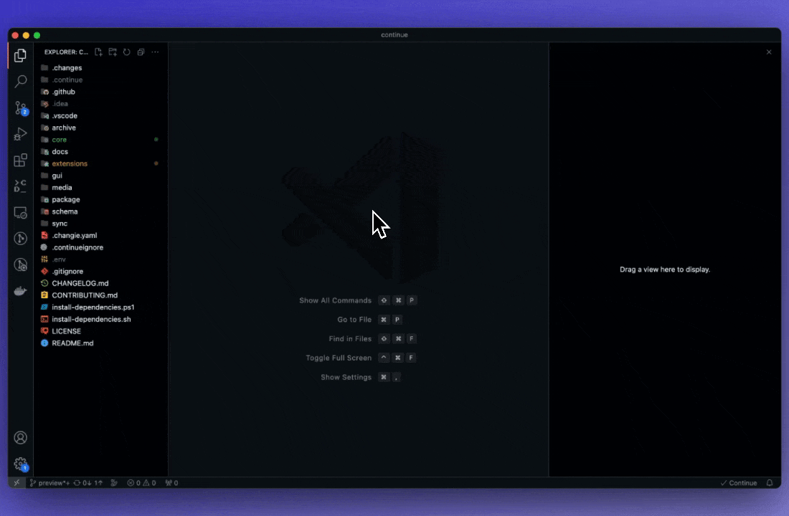

# 👋 Welcome to Continue

## ❗️ Before you get started

Continue is currently in the left sidebar, but we recommend moving it to the right. This way it won't cover your file explorer. You can move it back at any time.

## 🔑 Most important shortcuts

<kbd>Cmd/Ctrl</kbd> + <kbd>M</kbd> = Select code

<kbd>Cmd/Ctrl</kbd> + <kbd>Shift</kbd> + <kbd>M</kbd> = Select code for follow-up

<kbd>Cmd/Ctrl</kbd> + <kbd>Shift</kbd> + <kbd>L</kbd> = Quick edit

<kbd>Cmd/Ctrl</kbd> + <kbd>Shift</kbd> + <kbd>R</kbd> = Automatically debug terminal
