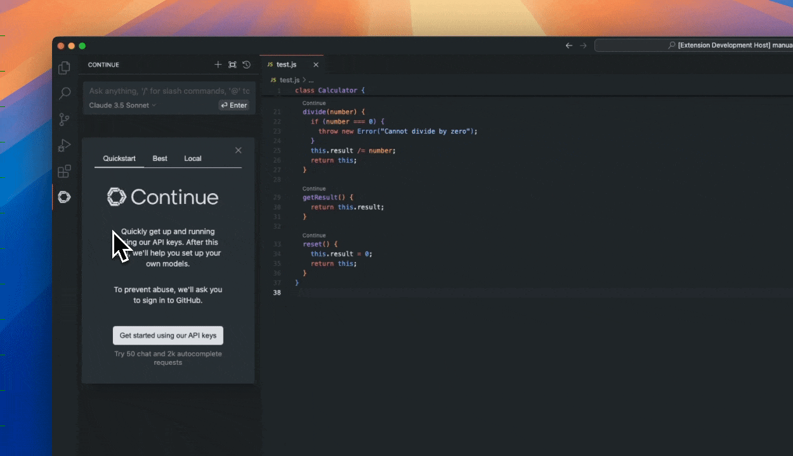

# Move Continue to the right sidebar

Continue is currently in the left sidebar, but we recommend moving it to the right.
This way it won't cover your file explorer.

You can move it back at any time. If you close the sidebar, it can be re-opened with <kbd>Cmd/Ctrl</kbd> + <kbd>L</kbd>.
