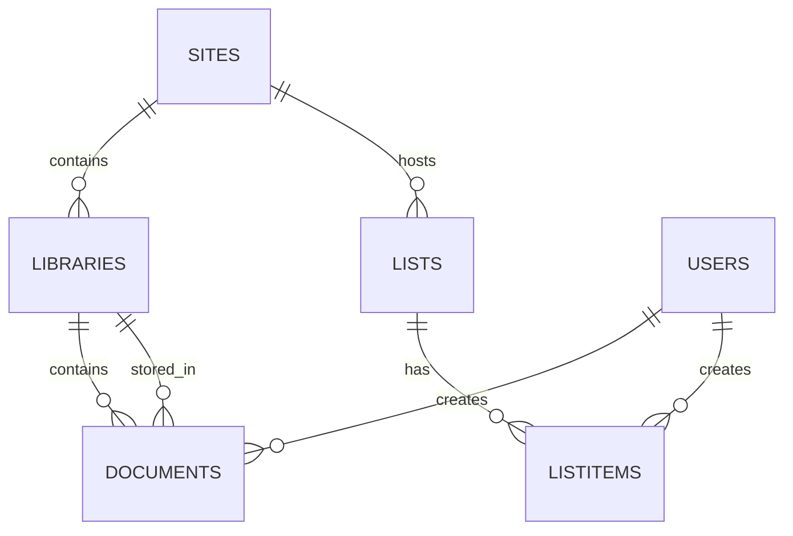

# Modelo semántico inicial y mapeo desde SharePoint

Resumen
- Propósito: definir tablas/datasets iniciales que cubran los escenarios analíticos comunes (inventario de sitios, bibliotecas, documentos, listas de negocio y actividad de usuarios).
- Principio: normalizar cuando tenga sentido, exponer vistas denormalizadas para Power BI cuando facilite el consumo.

Tablas propuestas (alto nivel)

1) Sites
- Descripción: metadatos de sitios de SharePoint
- Campos sugeridos: SiteId (PK), SiteUrl, Title, WebTemplate, OwnerPrincipal, CreatedDate, LastModifiedDate, TenantId
- Origen: Graph: GET /sites

2) Libraries
- Descripción: bibliotecas de documentos dentro de un sitio
- Campos: LibraryId (PK), SiteId (FK), Title, DriveId, IsShared, StorageQuota, ItemCount, LastModifiedDate
- Origen: Graph: GET /sites/{site-id}/drives (drive = document library)

3) Documents
- Descripción: metadatos por archivo
- Campos: DocumentId (PK), DriveId (FK), FileName, FilePath, SizeBytes, ContentType, CreatedBy, CreatedDateTime, LastModifiedBy, LastModifiedDateTime, Version, IsFile, IsCheckedOut, DownloadUrl
- Origen: Graph: GET /drives/{drive-id}/root/children and recursive listing

4) Lists
- Descripción: definiciones de listas (estructura y metadatos)
- Campos: ListId (PK), SiteId (FK), Title, Template, ItemCount, LastModifiedDate
- Origen: Graph: GET /sites/{site-id}/lists

5) ListItems (por lista)
- Descripción: datos de negocio desde listas (exponer columnas relevantes)
- Campos: ItemId (PK), ListId (FK), SiteId, Title, Column_{X}..., CreatedBy, CreatedDateTime, LastModifiedBy, LastModifiedDateTime
- Origen: Graph: GET /sites/{site-id}/lists/{list-id}/items?expand=fields
- Nota: mapear columnas por lista, posibles tablas específicas por lista (ej: Incidencias, Proyectos)

6) Users
- Descripción: catálogo de usuarios (grafico de Azure AD)
- Campos: UserId (PK), DisplayName, Mail, JobTitle, Department, UserPrincipalName, AccountEnabled
- Origen: Graph: GET /users (filtrar por pertenencia al tenant)

7) ActivityEvents
- Descripción: eventos de uso / actividad (view/edit/download) — idealmente desde SharePoint audit logs o Microsoft Graph activityReports / Office 365 Management Activity API
- Campos: EventId, SiteId, DriveId, DocumentId, UserId, ActionType, ActionTime, SourceIP, ClientApp
- Origen: Office 365 Management API / Graph reports / Audit logs

Vistas denormalizadas (para Power BI)
- DocumentsWithSite: combinación Documents + Sites + Libraries + (optionally Users for CreatedBy)
- ListItemsEnriched: ListItems + Sites + Users + lookup tables for status/categories

Mermaid ER diagram (básico)

Mapeo desde artefactos de SharePoint/Graph
- Sites -> /sites (Graph) o /sites/root/search
- Libraries -> /sites/{id}/drives
- Documents -> /drives/{drive-id}/root/children (y delta para incremental)
- Lists -> /sites/{id}/lists
- ListItems -> /sites/{site-id}/lists/{list-id}/items?expand=fields
- Users -> /users
- Activity -> Office 365 Management API (Audit.AzureActiveDirectory, SharePoint) o Graph activityReports

Notas sobre incremental
- Preferir endpoints delta cuando existan (eg. drives/items/delta) para detectar cambios incrementales.
- Registrar watermark (e.g., lastModifiedDateTime) por entidad para refresh incremental.

Extensiones / Consideraciones
- Para campos complejos (person, lookup, taxonomy) normalizar en tablas auxiliares o almacenar JSON en campos de texto para trazabilidad.
- Privacidad: enmascarar PII en datasets de desarrollo/staging.
